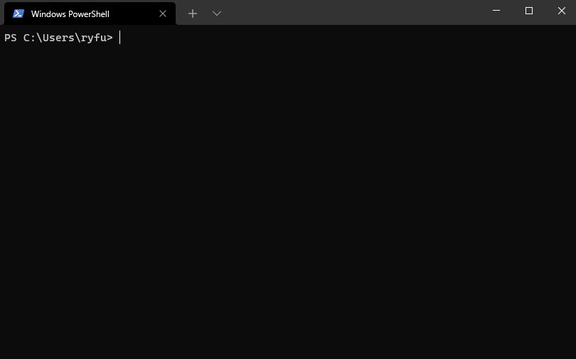

# Windows Package Manager Client 

This repository contains the source code for the Windows Package Manager Client.

If you are new to the Windows Package Manager, you might want to [Explore the Windows Package Manager tool](https://docs.microsoft.com/learn/modules/explore-windows-package-manager-tool/?WT.mc_id=AZ-MVP-5004737). The packages available to the client are in the [Windows Package Manager Community Repository](https://github.com/microsoft/winget-pkgs).

## Installing The Client

> The client requires Windows 10 1809 (build 17763) or later at this time. Windows Server 2019 is not supported as the Microsoft Store is not available nor are updated dependencies. It may be possible to install on Windows Server 2022, this should be considered experimental (not supported), and requires dependencies to be manually installed as well.

### Microsoft Store [Recommended]

The client is distributed within the [App Installer](ms-windows-store://pdp/?productid=9nblggh4nns1) package. 

### Development Releases

There are two methods to get development releases:

* Install a [Windows 10 or Windows 11 Insider](https://insider.windows.com/) build.
* Join the Windows Package Manager Insider program by [signing up](http://aka.ms/winget-InsiderProgram).

Note: it may take a few days to get the updated App Installer after you receive e-mail confirmation from joining the Windows Package Manager Insider program. If you decide to install the latest release from GitHub, and you have successfully joined the insider program, you will receive updates when the next development release has been published in the Microsoft Store.

Once you have received the updated App Installer from the Microsoft Store you should be able to execute `winget features` to see experimental features. Some users have reported [issues](https://github.com/microsoft/winget-cli/issues/210) with the client not being on their PATH.

### Manually Update

The same Microsoft Store package will be made available via our [Releases](https://github.com/microsoft/winget-cli/releases). Note that installing this package will give you the WinGet client, but it will not enable automatic updates from the Microsoft Store if you have not joined the Windows Package Manager Insider program.

> You may need to install the [VC++ v14 Desktop Framework Package](https://docs.microsoft.com/troubleshoot/cpp/c-runtime-packages-desktop-bridge#how-to-install-and-update-desktop-framework-packages).
> This should only be necessary on older builds of Windows 10 and only if you get an error about missing framework packages.

### Troubleshooting

Please read our [troubleshooting guide](/doc/troubleshooting/README.md).

## Administrator Considerations

Installer behavior can be different depending on whether you are running **winget** with administrator privileges.

* When running **winget** without administrator privileges, some applications may [require elevation](https://docs.microsoft.com/windows/security/identity-protection/user-account-control/how-user-account-control-works) to install. When the installer runs, Windows will prompt you to [elevate](https://docs.microsoft.com/windows/security/identity-protection/user-account-control/how-user-account-control-works#the-uac-user-experience). If you choose not to elevate, the application will fail to install.  

* When running **winget** in an Administrator Command Prompt, you will not see [elevation prompts](https://docs.microsoft.com/windows/security/identity-protection/user-account-control/how-user-account-control-works#the-uac-user-experience) if the application requires it. Always use caution when running your command prompt as an administrator, and only install applications you trust.

### Build your own

You can also [build the client yourself](#building-the-client). While the client should be perfectly functional, we are not ready to provide full support for clients running outside of the official distribution mechanisms yet. Feel free to file an Issue, but know that it may get lower prioritization.

## Build Status

## Windows Package Manager Release Roadmap
The plan for delivering next Windows Package Manager releases is described included in our [discussions](https://github.com/microsoft/winget-cli/discussions/2063), and will be updated as the project proceeds.

## Overview of the  Windows Package Manager
The **Windows Package Manager** is a tool designed to help you quickly and easily discover and install those packages that make your PC environment special.  By using the **Windows Package Manager**, from one command, you can install your favorite packages: 

`winget install <package>`

## Overview  

### Client Repository
This winget-cli repository includes the source code designed to build the client.  You are encouraged to participate in the development of this client. We have plenty of backlog features in our [Issues](https://github.com/microsoft/winget-cli/issues). You can upvote the ones you want, add more, or even [get started on one.](https://github.com/microsoft/winget-cli/projects/1)

### Sources
The client is built around the concept of sources; a set of packages effectively. Sources provide the ability to discover and retrieve the metadata about the packages, so that the client can act on it.

* The default "winget" source includes packages in the [Windows Package Manager Community Repository](https://github.com/microsoft/winget-pkgs).
* The default "msstore" source includes packages in the Microsoft Store.
* It is also possible to host your own private [REST based](https://github.com/microsoft/winget-cli-restsource) source.

## Building the client

### Prerequisites

* Windows 10 1809 (17763) or later
* [Developer Mode enabled](https://docs.microsoft.com/windows/uwp/get-started/enable-your-device-for-development)
* [Visual Studio 2019](https://visualstudio.microsoft.com/downloads/)
   * Or use winget to install it ;) (although you may need to adjust the workloads via Tools->Get Tools and Features...)
* The following workloads:
   * .NET Desktop Development
   * Desktop Development with C++
   * Universal Windows Platform Development
* The following extensions:
   * [Microsoft Visual Studio Installer Projects](https://marketplace.visualstudio.com/items?itemName=VisualStudioClient.MicrosoftVisualStudio2017InstallerProjects)

### Building

We currently only build using the solution; command line methods of building a VS solution should work as well.

## Credit

We would like to thank [Keivan Beigi (@kayone)](https://github.com/kayone) for his work on AppGet which helped us on the initial project direction for Windows Package Manager.

## Contributing

This project welcomes contributions and suggestions.  Most contributions require you to agree to a
Contributor License Agreement (CLA) declaring that you have the right to, and actually do, grant us
the rights to use your contribution. For details, visit https://cla.opensource.microsoft.com. More 
information is available in our [CONTRIBUTING.md](/CONTRIBUTING.md) file.

When you submit a pull request, a CLA bot will automatically determine whether you need to provide
a CLA and decorate the PR appropriately (e.g., status check, comment). Simply follow the instructions
provided by the bot. You will only need to do this once across all repos using our CLA.

This project has adopted the [Microsoft Open Source Code of Conduct](https://opensource.microsoft.com/codeofconduct/).
For more information, please refer to the [Code of Conduct FAQ](https://opensource.microsoft.com/codeofconduct/faq/) or
contact [opencode@microsoft.com](mailto:opencode@microsoft.com) with any additional questions or comments.

## Data/Telemetry

The winget.exe client is instrumented to collect usage and diagnostic (error) data and sends it to Microsoft to help improve the product. 

If you build the client yourself the instrumentation will not be enabled and no data will be sent to Microsoft.

The winget.exe client respects machine wide privacy settings and users can opt-out on their device, as documented in the Microsoft Windows privacy statement [here](https://support.microsoft.com/help/4468236/diagnostics-feedback-and-privacy-in-windows-10-microsoft-privacy). In addition, you may also explicitly block telemetry using [settings](https://docs.microsoft.com/en-us/windows/package-manager/winget/settings)

In short to opt-out, go to `Start`, then select `Settings` > `Privacy` > `Diagnostics & feedback`, and select `Basic`. 

See the [privacy statement](privacy.md) for more details.
