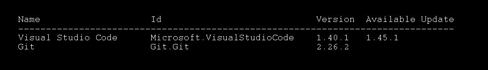

# Windows Package Manager update, Uninstall and List Command Spec

State: `DRAFT`

## Abstract

For our preview of the Windows Package Manager, the goal was to enable install of applications. In order to be a package manager, the Windows Package Manager must be able to list all installed packages, communicate if there is an update and uninstall applications.

This spec will cover the following commands: list, update, and uninstall.

## Inspiration

See abstract. :)

## Solution Design

* List
* Update 
* Uninstall

### List

The `list` command is a very specific search. List will show the applications currently installed. `List` will also compare the installed version to the known repository version. If there is an update available, this will be provided as well.

#### List Usage

`winget list [[-q] <query>] [<options>]`



`List` when executed by itself will show all applications installed by the Windows Package Manager.

#### List Arguments

The following arguments are available.

| Argument | Description |
|---|---|
| `-q`, `--query` | The query used to search for an application. |
| `-?`, `--help` | Gets additional help on this command. |

#### List Options

The following options are available.

| Option | Description |
|---|---|
| `--id` | Filter results by ID. |
| `--name` | Filter results by name. |
| `--moniker` | Filter results by application moniker. |
| `--tag` | Filter results by tag. |
| `--command` | Filter results by command. |
| `-s,--source` | Find the application using the specified [source](source.md). |
| `-e,--exact` | Find the application using exact match. |

By default `List` will show those applications installed, even those not installed by the Windows Package Manager.

> Note, we had previously discussed using all to differentiate between those applications install by `winget` and all other applications. We think just one query for all will suffice. If we need to determine which were installed by `winget` only, we will need to create an option.

To obtain this data, the Windows Package Manager will query the `Applications and Features` installed applications. This appears to be a superset of `Add Remove Programs` (ARP).

#### Common Id

In order to provide the user with a consistent experience with applications installed through the Windows Package Manager and those that were installed out of band, it is essential to have a common Id shared between Windows and the Windows Package Manager catalog. The Id we will use is either the ProductCode of MSI, or PackageFamilyName of MSIX.

#### Enumerating installed applications

##### MSI and EXE

The Windows Package Manager will be enumerate the installed MSI and EXE files by searching the ProductCodes in the uninstall locations.
The `ProductCode` will be read from the following locations:

```plaintext
64bit application:
`HKEY_LOCAL_MACHINE\SOFTWARE\Microsoft\Windows\CurrentVersion\Uninstall\`
32bit application:
`HKEY_LOCAL_MACHINE\SOFTWARE\WOW6432Node\Microsoft\Windows\CurrentVersion\Uninstall\`
```

Using the `ProductCode`, the Windows Package Manager will be able to determine if there is an update available in the community repository.

##### Windows Store applications and MSIX

`Store apps` and `MSIX` installers, the Windows Package Manager will use the `PackageFamilyName` to determine which applications are installed. For each app installed, we will query the store to see if there is an update available.

> Open Issue: What exactly can we display? Will we have the version? Need to close with Yao.

#### Mapping Ids To YAML files

Once the local files are enumerated, they must be mapped to the supported files in Community repository. To do this will will rely on the uninstall string used by the installer formats.For example:  `ProductCode` and `PackageFamilyName` as appropriate.

* [ProductCode](https://docs.microsoft.com/windows/win32/msi/product-codes)
* [PackageFamilyName](https://docs.microsoft.com/mem/configmgr/protect/deploy-use/find-a-pfn-for-per-app-vpn)
* `ZIP` undefined
* `Standalone exe` undefined

> Open issue: Need a better enum for zip and standalone exes.

For complete details on `ProductCode` and `PackageFamilyName` see [YAMLSPEC](..\ManifestSpecv0.2.md)

#### Determining update availability

Once the mapping is complete between the applications installed and the entry in the community repository, the client can determine if an update is available.

| Sequence | Result |
|---|---|
| Installed version >= Community version | No update |
| Installed version < Community version | Display newer version |
| Community version is 'latest' | *Get latest |

*If we can calculate the community version, to compare against the installed version, that is of course the preference.
Proposal for those applications we cannot tell if there is an update. Compare hashes. If hashes match, then assume there is no update available. If hashes do not match, then display Get Latest.

For Windows Store, the client will need to query the store to see if an update is available.

##### Freshness of the database

For `list` to display accurate information, the database of content must be up to date. The default experience for a downloaded catalog will be to refresh every 5 minutes. The default experience for RESTFUL apis will be to query the server at `list` execution.

### Update

The `update` command is designed to update one or more applications. The `update` command when executed with no parameters will generate a report of the files that would be updated. The `update` command with `--all` will update all packages that have updates available.

#### Update Usage

`winget update [[-q] <query>] [<options>]`

`Update` when executed with the `--all` option, it will update all applications ready for updates by the Windows Package Manager.

| Argument | Description |
|---|---|
| `-q,--query` | The query used to search for an application. |
| `-?, --help` | Gets additional help on this command. |

#### Update Options

The following options are available.

| Option | Description |
|---|---|
| `-m,--manifest` | The path to the manifest of the package. |
| `--all` | update all applications that are installed and have updates available.|
| `--id` | Filter results by ID. |
| `--name` | Filter results by name. |
| `--moniker` | Filter results by application moniker. |
| `--tag` | Filter results by tag. |
| `--command` | Filter results by command. |
| `-s,--source` | Find the application using the specified [source](source.md). |
| `-e,--exact` | Find the application using exact match. |

#### Update no parameters

If the user types `winget update` with no parameter, `winget` will detect the changes in applications, and inform the user of the potential updates available.


#### Update App Experience

The Update experience will mimic the install experience. When the user specifies `winget update appname` no additional prompting will be offered.

If the manifest requires that the previously installed version to be uninstalled, winget will first uninstall the previous version before executing installation of the update.

If the manifest specifies certain switches to be used for updates, these will be passed on the command line.  See the [YAMLSPEC](..\ManifestSpecv0.2.md) for more details.

#### Update --all Experience

The Update --all will automatically being updating all available updates. The user will not get additional prompting. This will allow for easy scripting.

#### Update app when no update is available

If the user attempts to update an app that there is no known update for, the package manager will issue an error.  
*There is no update available from the community repository. If you need to reinstall or repair the app, try `winget repair appname`.*

#### Update No packages found

Like with the install command, if winget cannot determine a specific package based on the query string, winget will error and ask for more specifics.  
*No package found matching input criteria. Type winget list to see available applications.*

#### Update -m, --manifest option

When the manifest option is passed to the Update command, it works just like with installer. If the version is less than the currently installed application, it will launch the Update process.
If the application is not already installed, this will generate an error.  
*The application "appname" is not installed, therefore no updates are available. If you would like to install the app, use the install command.*

#### Dependencies

Handling dependencies will be a challenge once Windows Package Manager supports dependencies. Dependencies are not covered as part of this spec.

> Open issue: If the application is not side by side, it will force an uninstall of the previous version to Update. We will need to assume the installer wil handle.

### Uninstall

The `uninstall` command is designed to uninstall an application. The uninstall command will be executed based on the string in the registry when it comes to ProductCode or Remove-AppPackage when it comes to MSIX and Store apps.

#### Uninstall Usage

`winget uninstall [[-q] <query>] [<options>]`


| Argument | Description |
|--------------|-------------|
| `-q,--query` | The query used to search for an application. |
| `-?, --help` | Gets additional help on this command. |

#### Uninstall Options

The following options are available.

| Option | Description |
|--------------|-------------|
| `-m,--manifest` | The path to the manifest of the package. |
| `--id` | Filter results by ID. |
| `--name` | Filter results by name. |
| `--moniker` | Filter results by application moniker. |
| `--tag` | Filter results by tag
| `--command` | Filter results by command
| `-s,--source` | Find the application using the specified [source](source.md). |
| `-e,--exact` | Find the application using exact match. |

#### Uninstall Command

Determining the uninstall string will be based on the type of installer. For EXEs and MSIs the command will be shellexec. If the app requires elevation, then the user will be prompted.

##### ProductCode

`MSI` and `EXE` installers, the Windows Package Manager will use the `ProductCode` to discover the uninstall string. product code - typically a GUID that is found in the uninstall registry location and includes the brackets like `{5740BD44-B58D-321A-AFC0-6D3D4556DD6C}`.

The `ProductCode` will be read from the following locations:

```plaintext
64bit application:
`HKEY_LOCAL_MACHINE\SOFTWARE\Microsoft\Windows\CurrentVersion\Uninstall\`
32bit application:
`HKEY_LOCAL_MACHINE\SOFTWARE\WOW6432Node\Microsoft\Windows\CurrentVersion\Uninstall\`
```

For inno, wix, nullsoft, and exe, the ProductCode should be a string that is located in either of the Uninstall keys above.

The typical uninstall command is listed as `UninstallString`. The value equates to the command to execute.

`Silent Uninstall` Some installers provide a silent uninstall. This would be provided with a different string.

##### PackageFamilyName

`Store apps` and `MSIX` installers, the `PackageFamilyName` will be used. Remove

##### Zip files and Other

We expect to add Zip Support. As such, ZIP does not have a unique identifier. The Windows Package Manager will need to track where the files were installed, so that it can remove the file and preserve the users files.

#### No packages found

Like with the install command, if winget cannot determine a specific package based on the query string, winget will error and ask for more specifics.

*No package found matching input criteria. Type winget list to see which applications are installed.*

#### uninstall -m, --manifest option

When the manifest option is passed to the uninstall command, it cause winget to attempt to uninstall this application.

If the application is not already installed, this will generate an error.
*The application "appname" is not installed*

##### Error Cases

If the application does not include an uninstall string then the uninstall will not be available. Calling uninstall on an application with no uninstall string will result in the following error:

*The Windows Package Manager cannot locate the uninstall command for this application. Please reach out to the application publisher for support.*

## UI/UX Design

[comment]: # What will this fix/feature look like? How will it affect the end user?

## Capabilities

[comment]: # Discuss how the proposed fixes/features impact the following key considerations:

### Accessibility

[comment]: # How will the proposed change impact accessibility for users of screen readers, assistive input devices, etc.

### Security

[comment]: # How will the proposed change impact security?

### Reliability

[comment]: # Will the proposed change improve reliability? If not, why make the change?

### Compatibility

[comment]: # Will the proposed change break existing code/behaviors? If so, how, and is the breaking change "worth it"?

### Performance, Power, and Efficiency

## Potential Issues

[comment]: # What are some of the things that might cause problems with the fixes/features proposed? Consider how the user might be negatively impacted.

## Future considerations

[comment]: # What are some of the things that the fixes/features might unlock in the future? Does the implementation of this spec enable scenarios?

## Resources

[comment]: # Be sure to add links to references, resources, footnotes, etc.

## History 
| Version | Details | Date |
|---|---|---|
| .001 | Draft | 6/03/2020 |
| .002 | Cleaned up some HTML and MD. Thanks Megamorf. | 6/04/2020 |
| .003 | Massive update to cause everyone pain. Sorry about that. | 9/04/2020 |
| .004 | Renamed upgrade to update.  Updated the list, update and uninstall features.  Most notably ProductCode and PackageFamilyName | 9/17/2020 |
