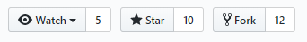
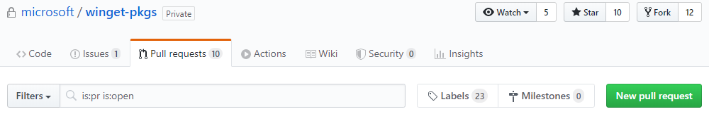

# Submit your manifest to the repository

[!INCLUDE [preview-note](../../includes/package-manager-preview.md)]

After you create a [package manifest](manifest.md) that describes your application, you're ready to submit your manifest to the Windows Package Manager repository. This a public-facing repository that contains a collection of manifests that the **winget** tool can access. To submit your manifest, you'll upload it to the open source [https://github.com/microsoft/winget-pkgs](https://github.com/microsoft/winget-pkgs) repository on GitHub.

After you submit a **pull request** to add a new manifest to the GitHub repository, an automated process will validate your manifest file and check to make sure the package complies with the [Windows Package Manager polices](.\windows-package-manager-policies.md) and is not known to be malicious. If this validation is successful, your package will be added to the public-facing Windows Package Manager repository so it can be discovered by the **winget** client tool. Note the distinction between the manifests in the open source GitHub repository and the public-facing Windows Package Manager repository.

> [!IMPORTANT]
> Microsoft reserves the right to refuse a submission for any reason.

## Third-party repositories

There are currently no known third party repositories. Microsoft is working with multiple partners to develop protocols or an API to enable third party repositories.

## Manifest validation

When you submit a manifest to the [https://github.com/microsoft/winget-pkgs](https://github.com/microsoft/winget-pkgs) repository on GitHub, your manifest will be automatically validated and evaluated for the safety of the Windows ecosystem. Manifests may also be reviewed manually.

For information on the validation process, see [Windows Package Manager validation](.\winget-validation.md)

## How to submit your manifest

To submit a manifest to the repository, follow these steps.

### Step 1: Validate your manifest

The **winget** tool provides the [validate](..\winget\validate.md) command to confirm that you have created your manifest correctly. To validate your manifest, use this command.

```CMD
winget validate \<manifest-file>
```

If your validation fails, use the errors to locate the line number and make a correction. After your manifest is validated, you can submit it to the repository.

### Step 2: Clone the repository

Next, create a fork of the repository and clone it.

1. Go to [https://github.com/microsoft/winget-pkgs](https://github.com/microsoft/winget-pkgs) in your browser and click **Fork**.
    

2. From a command line environment such as the Windows Command Prompt or PowerShell, use the following command to clone your fork.
    ```CMD
    git clone \<your-fork-name>
    ```

 3. If you are making multiple submissions, make a branch instead of a fork. We currently allow only one manifest file per submission.
    ```CMD
    git checkout -b \<branch-name>
    ```

### Step 3: Add your manifest to the local repository

You must add your manifest file to the repository in the following folder structure:

**manifests** / **letter** / **publisher** / **application** / **version** / **Yaml file**

* The **manifests** folder is the root folder for all manifests in the repository.
* The **letter** folder is the first letter of the publisher name.
* The **publisher** folder is the name of the company that publishes the software. For example, **Microsoft**.
* The **application** folder is the name of the application or tool. For example, **VSCode**.
* The **version** folder is the version of the application or tool. For example, **1.0.0**.
* **Yaml File** is the file name of the manifest. The file name must be set to the name and publisher of the application. For example, **Contoso.ContosoApp.yaml**.

The `PackageIdentifier` value in the manifest must match the publisher and application names in the manifest folder path, and the `PackageVersion` value in the manifest must match the version in the file name. For more information, see [Create your package manifest](manifest.md#tips-and-best-practices).

### Step 4: Submit your manifest to the remote repository

You're now ready to push your new manifest to the remote repository.

1. Use the `add` command to prepare for submission.
    ```CMD
    git add manifests\C\Contoso\ContosoApp\1.0.0\Contoso.ContosoApp.yaml
    ```

2. Use the `commit` command to commit the change and provide information on the submission.
    ```CMD
    git commit -m "Submitting ContosoApp version 1.0.0"
    ```

3. Use the `push` command to push the changes to the remote repository.
    ```CMD
    git push
    ```

### Step 5: Create a pull request

After you push your changes, return to [https://github.com/microsoft/winget-pkgs](https://github.com/microsoft/winget-pkgs) and create a **pull request** to merge your fork or branch to the main branch.



## Submission process

When you create a **pull request**, this will start an automated process that validates the manifests and verifies your **pull request**. During this process we will run tests against the installer and installed binaries to validate the submission.

We add labels to your **pull request** so you can track its progress.  For more information on labels and the process see [Windows Package Manager validation](.\winget-validation.md).  

Once complete, your submission will be manually reviewed by a moderator, and after it is approved, your application will be added to the Windows Package Manager catalog.

If there is ever an error during the process, you will be notified and our labels and bot will assist you in fixing your submission.  For the list of common errors, see [Windows Package Manager validation](.\winget-validation.md).  
