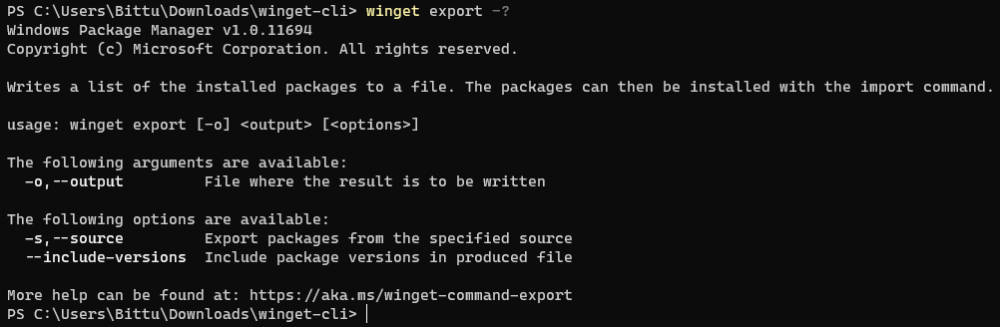

# export command (winget)

The **export** command of the [winget](index.md) tool writes a JSON file of installed packages to a specified file. The packages can then be installed with the [**import**](import.md) command.

The **export** command is often used to create a file that you can share with other developers or use when restoring your development environment.

## Usage

`winget export [-o] <output> [<options>]`

## Arguments

The following arguments are available.

| Argument | Description |
|-------------|-------------|
| **-o, --output** | File where the result is to be written. |

## Options

The following options are available.

| Option | Description |
|--------|-------------|
| **-s, --source** | Export packages from the specified source. |
| **--include-versions** | Include package versions in the export file. |
| **--accept-source-agreements** | Accept all source agreements during source operations. |
| **-?, --help** | Shows help about the selected command. |
| **--wait** | Prompts the user to press any key before exiting. |
| **--logs, --open-logs** | Open the default logs location. |
| **--verbose, --verbose-logs** | Enables verbose logging for winget. |
| **--nowarn, --ignore-warnings** | Suppresses warning outputs. |
| **--disable-interactivity** | Disable interactive prompts. |
| **--proxy** | Set a proxy to use for this execution. |
| **--no-proxy** | Disable the use of proxy for this execution. |

## JSON schema

The driving force behind the **export** command is the JSON file. You can see the schema at [https://aka.ms/winget-packages.schema.1.0.json](https://aka.ms/winget-packages.schema.1.0.json).

## Related topics

* [Use the winget tool to install and manage applications](index.md)
* [import command](import.md)
