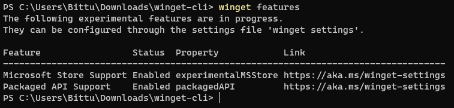

# features command (winget)

[!INCLUDE [preview-note](../../includes/package-manager-preview.md)]

The **features** command of the [winget](index.md) tool displays a list of the experimental features available with your version of the Windows Package Manager.

Each feature can be turned on individually by enabling the features through [**settings**](.\settings.md).

You can find the latest up to date information features on the [experimental features](https://aka.ms/winget-experimentalfeatures) web page.

## Usage

`winget features`

Notice above that the status of each feature is listed.  If the feature is **disabled** you will not be able to use it.  If the feature is **enabled** you will notice that the command will be available to you through winget.

To enabled any disabled features, go to **settings** and enable the feature.

Note: features may be managed by group policy. You can use the **winget --info** command to view any policies in effect on your system.
