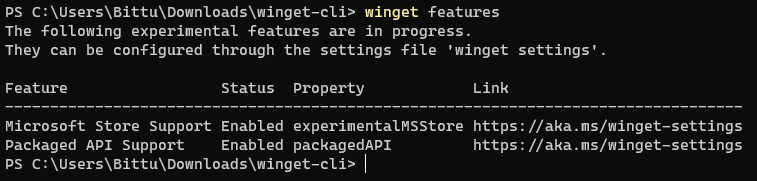

# features command (winget)

The **features** command of the [winget](index.md) tool displays the status of experimental features available in your version of Windows Package Manager.

Experimental features can be turned on through [**settings**](settings.md).

## Usage

`winget features [<options>]`

## Options

| Option | Description |
|--------|-------------|
| **-?, --help** | Shows help about the selected command. |
| **--wait** | Prompts the user to press any key before exiting. |
| **--logs, --open-logs** | Open the default logs location. |
| **--verbose, --verbose-logs** | Enables verbose logging for winget. |
| **--nowarn, --ignore-warnings** | Suppresses warning outputs. |
| **--disable-interactivity** | Disable interactive prompts. |
| **--proxy** | Set a proxy to use for this execution. |
| **--no-proxy** | Disable the use of proxy for this execution. |

Note: features may be managed by Group Policy. You can use `winget --info` to view policies in effect on your system.

## Related topics

* [Use the winget tool to install and manage applications](index.md)
* [settings command](settings.md)
