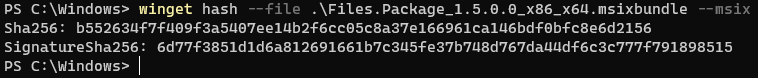

# hash command (winget)

The **hash** command of the [winget](index.md) tool generates the SHA256 hash for an installer. This command is commonly used when creating a [manifest file](../package/manifest.md) for submission to the Windows Package Manager repository. It can also compute the hash of the signature file of an MSIX package to enable streaming installations.

## Usage

`winget hash [-f] <file> [<options>]`

The **hash** command can only run on a local file. Download your installer to a known location, then pass the file path as an argument.

## Arguments

The following arguments are available:

| Argument | Description |
|--------------|-------------|
| **-f, --file** | File to be hashed. |

## Options

The following options are available:

| Option | Description |
|--------|-------------|
| **-m, --msix** | Input file will be treated as MSIX; signature hash will be provided if signed. |
| **-?, --help** | Shows help about the selected command. |
| **--wait** | Prompts the user to press any key before exiting. |
| **--logs, --open-logs** | Open the default logs location. |
| **--verbose, --verbose-logs** | Enables verbose logging for winget. |
| **--nowarn, --ignore-warnings** | Suppresses warning outputs. |
| **--disable-interactivity** | Disable interactive prompts. |
| **--proxy** | Set a proxy to use for this execution. |
| **--no-proxy** | Disable the use of proxy for this execution. |

## Related topics

* [Use the winget tool to install and manage applications](index.md)
* [Submit packages to Windows Package Manager](../package/index.md)
