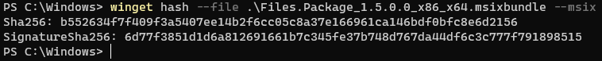

# hash command (winget)

The **hash** command of the [winget](index.md) tool generates the SHA256 hash for an installer. This command is used if you need to create a [manifest file](../package/manifest.md) for submitting software to the **Microsoft Community Package Manifest Repository** on GitHub. In addition, the **hash** command also supports generating a SHA256 certificate hash for MSIX files.

## Usage

`winget hash [--file] <file> [<options>]`

The **hash** sub-command can only run on a local file. To use the **hash** sub-command, download your installer to a known location. Then pass in the file path as an argument to the **hash** sub-command.

## Arguments

The following arguments are available:

| Argument  | Description |
|--------------|-------------|
| **-f, --file** |  The path to the file to be hashed. |

## Options

The following options are available:

| Option | Description |
|--------|-------------|
| **-m, --msix**  | Specifies that the hash command will also create the SHA-256 SignatureSha256 for use with MSIX installers. |
| **-?, --help** |  Gets additional help on this command. |
| **--wait** | Prompts the user to press any key before exiting |
| **--logs, --open-logs** | Open the default logs location |
| **--verbose, --verbose-logs** | Enables verbose logging for winget |
| **--disable-interactivity** | Disable interactive prompts |

## Related topics

* [Use the winget tool to install and manage applications](index.md)
* [Submit packages to Windows Package Manager](../package/index.md)
