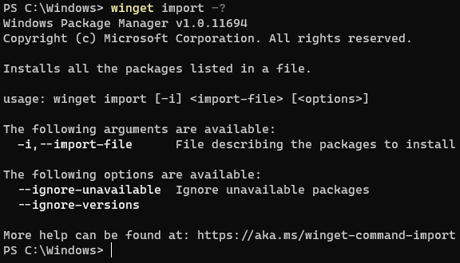
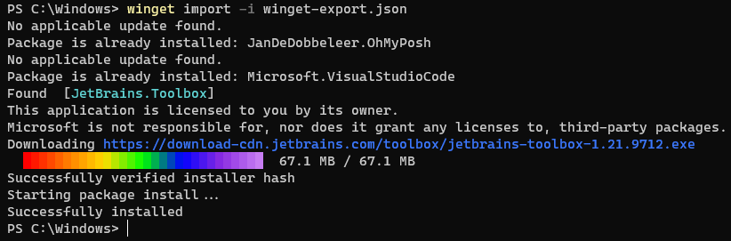

# import command (winget)

The **import** command of the [winget](index.md) tool imports a JSON file of apps to install.  The **import** command combined with the [**export**](export.md) command allows you to batch install applications on your PC.

The **import** command is often used to share your developer environment or build up your PC image with your favorite apps.

## Usage

`winget import [-i] <import-file> [<options>]`

## Arguments

The following arguments are available.
| Argument    | Description |
|-------------|-------------|
| **-i, --import-file** | JSON file describing the packages to install

## Options

The options allow you to customize the import experience to meet your needs.

| Option | Description |
|-------------|-------------|
| **--ignore-unavailable** | Suppresses errors if the app requested is unavailable |
| **--ignore-versions** | Ignores versions specified in the JSON file and installs the latest available version |
| **--no-upgrade** | Skips upgrade if an installed version already exists |
| **--accept-package-agreements** | Accept all license agreements for packages |
| **--accept-source-agreements** | Accept all source agreements during source operations |
| **-?, --help** | Shows help about the selected command |
| **--wait** | Prompts the user to press any key before exiting |
| **--logs, --open-logs** | Open the default logs location |
| **--verbose, --verbose-logs** | Enables verbose logging for winget |
| **--disable-interactivity** | Disable interactive prompts |

## JSON Schema
The driving force behind the **import** command is the JSON file.  You can find the schema for the JSON file [here](https://aka.ms/winget-packages.schema.1.0.json).

The JSON file includes the following hierarchy:
| Entry      | Description |
|-------------|-------------|
| **Sources**  |  The sources application manifests come from.  |
| **Packages**  |  The collection of packages to install.  |
| **PackageIdentifier**  |  The Windows Package Manager package identifier used to specify the package.  |
| **Version**  |  [optional] The specific version of the package to install.  |

## Importing files

When the Windows Package Manager imports the JSON file, it attempts to install the specified applications in a serial fashion. If the application is not available or the application is already installed, it will notify the user of that case.

You will notice in the example above, **Microsoft.VisualStudioCode** and **JanDeDobbeleer.OhMyPosh** were already installed. Therefore the import command skipped the installation.
