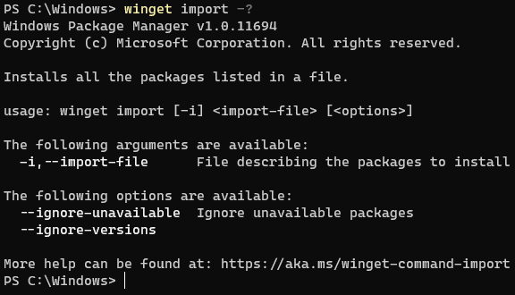
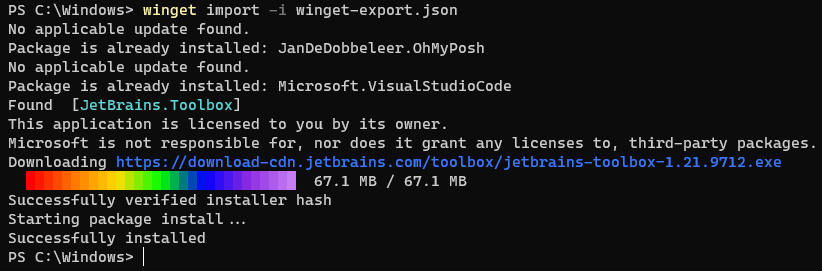

# import command (winget)

The **import** command of the [winget](index.md) tool installs the packages listed in a JSON file. The **import** command combined with the [**export**](export.md) command allows you to batch install applications on your PC.

## Usage

`winget import [-i] <import-file> [<options>]`

## Arguments

The following arguments are available.

| Argument | Description |
|-------------|-------------|
| **-i, --import-file** | File describing the packages to install. |

## Options

The following options are available.

| Option | Description |
|-------------|-------------|
| **--ignore-unavailable** | Ignore unavailable packages. |
| **--ignore-versions** | Ignore package versions in the import file. |
| **--no-upgrade** | Skips upgrade if an installed version already exists. |
| **--accept-package-agreements** | Accept all license agreements for packages. |
| **--accept-source-agreements** | Accept all source agreements during source operations. |
| **-?, --help** | Shows help about the selected command. |
| **--wait** | Prompts the user to press any key before exiting. |
| **--logs, --open-logs** | Open the default logs location. |
| **--verbose, --verbose-logs** | Enables verbose logging for winget. |
| **--nowarn, --ignore-warnings** | Suppresses warning outputs. |
| **--disable-interactivity** | Disable interactive prompts. |
| **--proxy** | Set a proxy to use for this execution. |
| **--no-proxy** | Disable the use of proxy for this execution. |

## JSON schema

The import file follows the schema at [https://aka.ms/winget-packages.schema.1.0.json](https://aka.ms/winget-packages.schema.1.0.json).

## Importing files

When Windows Package Manager imports the JSON file, it attempts to install the specified applications serially. If an application is unavailable or is already installed, it will notify the user.

In the example above, **Microsoft.VisualStudioCode** and **JanDeDobbeleer.OhMyPosh** were already installed. Therefore, the import command skipped the installation.

## Related topics

* [Use the winget tool to install and manage applications](index.md)
* [export command](export.md)
