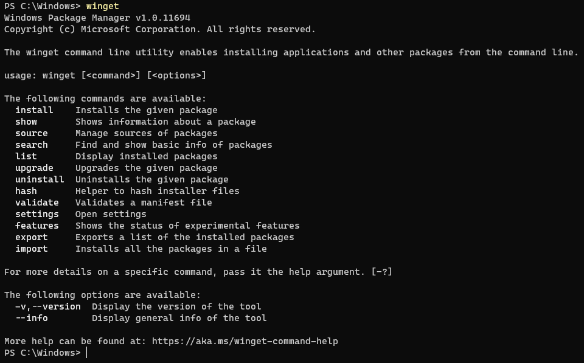

# Use the winget tool to install and manage applications

The **winget** command line tool enables users to discover, install, upgrade, remove and configure applications on Windows 10 and Windows 11 computers. This tool is the client interface to the Windows Package Manager service.

## Install winget

There are several ways to install the **winget** tool:

* The **winget** tool is included in the flight or preview version of [Windows App Installer](https://www.microsoft.com/p/app-installer/9nblggh4nns1?ocid=9nblggh4nns1_ORSEARCH_Bing&rtc=1&activetab=pivot:overviewtab). You must install the preview version of **App Installer** to use **winget**. To gain early access, submit your request to the [Windows Package Manager Insiders Program](https://aka.ms/AppInstaller_InsiderProgram). Participating in the flight ring will guarantee you see the latest preview updates.

* Participate in the [Windows Insider Dev Channel](https://insider.windows.com/understand-flighting).

* Install the Windows Desktop App Installer package located on the [Releases page for the winget repository](https://github.com/microsoft/winget-cli/releases).

> The **winget** tool is supported on Windows 10, version 1809 (build 17763) and above.

## Administrator considerations

Installer behavior can be different depending on whether you are running **winget** with administrator privileges.

* When running **winget** without administrator privileges, some applications may [require elevation](https://docs.microsoft.com/windows/security/identity-protection/user-account-control/how-user-account-control-works) to install. When the installer runs, Windows will prompt you to [elevate](https://docs.microsoft.com/windows/security/identity-protection/user-account-control/how-user-account-control-works). If you choose not to elevate, the application will fail to install.

* When running **winget** in an Administrator Command Prompt, you will not see [elevation prompts](https://docs.microsoft.com/windows/security/identity-protection/user-account-control/how-user-account-control-works) if the application requires it. Always use caution when running your command prompt as an administrator, and only install applications you trust.

## Use winget

After **App Installer** is installed, you can run **winget** by typing 'winget' from a Command Prompt.

One of the most common usage scenarios is to search for and install a favorite tool.

1. To [search](search.md) for a tool, type `winget search <appname>`.
2. After you have confirmed that the tool you want is available, you can [install](install.md) the tool by typing `winget install <appname>`. The **winget** tool will launch the installer and install the application on your PC.
    
3. In addition to install and search, **winget** provides a number of other commands that enable you to [show details](show.md) on applications, [change sources](source.md), and [validate packages](validate.md). To get a complete list of commands, type: `winget --help`.
    

### Commands

The current preview of the **winget** tool supports the following commands.
| Command | Description |
|---------|-------------|
| [install](install.md) | Installs the specified application. |
| [show](show.md) | Displays details for the specified application. |
| [source](source.md) | Adds, removes, and updates the Windows Package Manager repositories accessed by the **winget** tool. |
| [search](search.md) | Searches for an application. |
| [list](list.md) | Display installed packages. |
| [upgrade](upgrade.md) |  Upgrades the given package. |
| [uninstall](uninstall.md) | Uninstalls the given package. |
| [hash](hash.md) | Generates the SHA256 hash for the installer. |
| [validate](validate.md) | Validates a manifest file for submission to the Windows Package Manager repository. |
| [settings](settings.md) | Open settings. |
| [features](features.md) | Shows the status of experimental features. |
| [export](export.md) | Exports a list of the installed packages. |
| [import](import.md) | Installs all the packages in a file. |
| pin | Manage package pins. |
| configure | Configures the system into a desired state. |
| download | Downloads the installer from a given package. |

### Options

The current version of the **winget** tool supports the following options.

| Option | Description |
|--------------|-------------|
| **-v, --version** | Returns the current version of winget. |
| **--info** |  Provides you with all detailed information on winget, including the links to the license, privacy statement, and configured group policies. |
| **-?, --help** |  Shows additional help for winget. |
| **--wait** | Waits for user input upon command completion. |
| **--logs,--open-logs** | Open the default logs location |
| **--verbose,--verbose-logs** | Enables verbose logging for winget |
| **--disable-interactivity** | Disable interactive prompts |

## Supported installer formats

The current version of the **winget** tool supports the following types of installers:

* EXE (with **Silent** and **SilentWithProgress** flags)
* INNO
* NULLSOFT
* MSI
* APPX
* MSIX
* BURN
* PORTABLE
* ZIP

## Scripting winget

You can author batch scripts and PowerShell scripts to install multiple applications.

```CMD
@echo off
Echo Install Powertoys and Terminal
REM Powertoys
winget install Microsoft.Powertoys
if %ERRORLEVEL% EQU 0 Echo Powertoys installed successfully.
REM Terminal
winget install Microsoft.WindowsTerminal
if %ERRORLEVEL% EQU 0 Echo Terminal installed successfully. %ERRORLEVEL%
```

> When scripted, **winget** will launch the applications in the specified order. When an installer returns success or failure, **winget** will launch the next installer. If an installer launches another process, it is possible that it will return to **winget** prematurely. This will cause **winget** to install the next installer before the previous installer has completed.

## Missing tools

If the [community repository](../package/repository.md) does not include your tool or application, please submit a package to our [repository](https://github.com/microsoft/winget-pkgs). By adding your favorite tool, it will be available to you and everyone else.

## Customize winget settings

You can configure the **winget** command line experience by modifying the **settings.json** file. For more information, see [https://aka.ms/winget-settings](https://aka.ms/winget-settings). Note that the settings are still in an experimental state and not yet finalized for the preview version of the tool.

## Open source details

The **winget** tool is open source software available on GitHub in the repo [https://github.com/microsoft/winget-cli/](https://github.com/microsoft/winget-cli/). The source for building the client is located in the [src folder](https://github.com/microsoft/winget-cli/tree/master/src).

The source for **winget** is contained in a Visual Studio solution. To build the solution correctly, install the latest [Visual Studio with the C++ workload](https://visualstudio.microsoft.com/downloads/).

We encourage you to contribute to the **winget** source on GitHub. You must first agree to and sign the Microsoft CLA.
