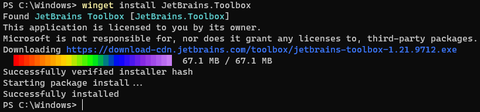

# install command (winget)

[!INCLUDE [preview-note](../../includes/package-manager-preview.md)]

The **install** command of the [winget](index.md) tool installs the specified application. Use the [**search**](search.md) command to identify the application you want to install.  

The **install** command requires that you specify the exact string to install. If there is any ambiguity, you will be prompted to further filter the **install** command to  an exact application.

## Usage

`winget install [[-q] \<query>] [\<options>]`



## Arguments

The following arguments are available.

| Argument      | Description |
|-------------|-------------|  
| **-q,--query**  |  The query used to search for an app. |
| **-?, --help** |  Get additional help on this command. |

## Options

The options allow you to customize the install experience to meet your needs.

| Option      | Description |
|-------------|-------------|  
| **-m, --manifest** |   Must be followed by the path to the manifest (YAML) file. You can use the manifest to run the install experience from a [local YAML file](#local-install). |
| **--id**    |  Limits the install to the ID of the application.   |  
| **--name**   |  Limits the search to the name of the application. |  
| **--moniker**   | Limits the search to the moniker listed for the application. |  
| **-v, --version**  |  Enables you to specify an exact version to install. If not specified, latest will install the highest versioned application. |  
| **-s, --source**   |  Restricts the search to the source name provided. Must be followed by the source name. |  
| **-e, --exact**   |   Uses the exact string in the query, including checking for case-sensitivity. It will not use the default behavior of a substring. |  
| **-i, --interactive** |  Runs the installer in interactive mode. The default experience shows installer progress. |  
| **-h, --silent** |  Runs the installer in silent mode. This suppresses all UI. The default experience shows installer progress. |  
| **-o, --log**  |  Directs the logging to a log file. You must provide a path to a file that you have the write rights to. |
| **--override** | A string that will be passed directly to the installer.    |
| **-l, --location** |    Location to install to (if supported). |

### Example queries

The following example installs a specific version of an application.

```CMD
winget install powertoys --version 0.15.2
```

The following example installs an application from its ID.

```CMD
winget install --id Microsoft.PowerToys
```

The following example installs an application by version and ID.

```CMD
winget install --id Microsoft.PowerToys --version 0.15.2
```

## Multiple selections

If the query provided to **winget** does not result in a single application, then **winget** will display the results of the search. This will provide you with the additional data necessary to refine the search for a correct install.

The best way to limit the selection to one file is to use the **id** of the application combined with the **exact** query option.  For example:

```CMD
winget install --id Git.Git -e 
```

If multiple sources are configured, it is possible to have duplicate entries. Specifying a source is required to further disambiguate.

```CMD
winget install --id Git.Git -e -source winget
```

## Local install

The **manifest** option enables you to install an application by passing in a YAML file directly to the client. If the manifest is a multi file manifest, the directory containing the files must be used. The **manifest** option has the following usage.

Usage: `winget install --manifest \<path>`

| Option  | Description |
|-------------|-------------|  
|  **-m, --manifest** | The path to the manifest of the application to install. |

### Log files

The log files for winget unless redirected, will be located in the following folder:  **\%temp%\\AICLI\\*.log**

## Related topics

* [Use the winget tool to install and manage applications](index.md)
