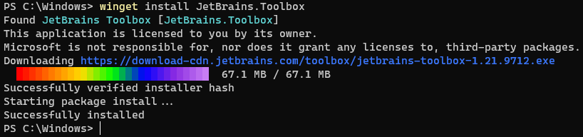

# install command (winget)

The **install** command of the [winget](index.md) tool installs the specified application. Use the [**search**](search.md) command to identify the application you want to install.

The **install** command requires that you specify the exact string to install. If there is any ambiguity, you will be prompted to further filter the **install** command to an exact application.

## Usage

`winget install [[-q] <query>...] [<options>]`

The following command aliases are available: \
`add`



## Arguments

The following arguments are available.

| Argument | Description |
|-------------|-------------|
| **-q, --query** | The query used to search for a package. |

## Options

The options allow you to customize the install experience to meet your needs.

| Option | Description |
|-------------|-------------|
| **-m, --manifest** | The path to the manifest of the package. You can use the manifest to run the install experience from a [local YAML file](#local-install). |
| **--id** | Filter results by id. |
| **--name** | Filter results by name. |
| **--moniker** | Filter results by moniker. |
| **-v, --version** | Use the specified version; default is the latest version. |
| **-s, --source** | Find package using the specified source. |
| **--scope** | Select install scope (user or machine). |
| **-a, --architecture** | Select the architecture. |
| **--installer-type** | Select the installer type. |
| **-e, --exact** | Find package using exact match. |
| **-i, --interactive** | Request interactive installation; user input may be needed. |
| **-h, --silent** | Request silent installation. |
| **--locale** | Locale to use (BCP47 format). |
| **-o, --log** | Log location (if supported). |
| **--custom** | Arguments to be passed on to the installer in addition to the defaults. |
| **--override** | Override arguments to be passed on to the installer. |
| **-l, --location** | Location to install to (if supported). |
| **--ignore-security-hash** | Ignore the installer hash check failure. |
| **--allow-reboot** | Allows a reboot if applicable. |
| **--skip-dependencies** | Skips processing package dependencies and Windows features. |
| **--dependencies-only** | Installs only the dependencies of the package. |
| **--ignore-local-archive-malware-scan** | Ignore the malware scan performed as part of installing an archive type package from local manifest. |
| **--dependency-source** | Find package dependencies using the specified source. |
| **--accept-package-agreements** | Accept all license agreements for packages. |
| **--no-upgrade** | Skips upgrade if an installed version already exists. |
| **--header** | Optional Windows-Package-Manager REST source HTTP header. |
| **--authentication-mode** | Specify authentication window preference (`silent`, `silentPreferred`, or `interactive`). |
| **--authentication-account** | Specify the account to be used for authentication. |
| **--accept-source-agreements** | Accept all source agreements during source operations. |
| **-r, --rename** | The value to rename the executable file (portable). |
| **--uninstall-previous** | Uninstall the previous version of the package during upgrade. |
| **--force** | Direct run the command and continue with non security related issues. |
| **--ignore-unavailable** | Ignore unavailable packages. |
| **-?, --help** | Shows help about the selected command. |
| **--wait** | Prompts the user to press any key before exiting. |
| **--logs, --open-logs** | Open the default logs location. |
| **--verbose, --verbose-logs** | Enables verbose logging for winget. |
| **--nowarn, --ignore-warnings** | Suppresses warning outputs. |
| **--disable-interactivity** | Disable interactive prompts. |
| **--proxy** | Set a proxy to use for this execution. |
| **--no-proxy** | Disable the use of proxy for this execution. |

### Example queries

The following example installs a specific version of an application.

```CMD
winget install powertoys --version 0.15.2
```

The following example installs an application from its **Package Identifier**.

```CMD
winget install --id Microsoft.PowerToys
```

The following example installs an application by version and ID.

```CMD
winget install --id Microsoft.PowerToys --version 0.15.2
```

## Multiple selections

If the query provided to **winget** does not result in a single application, then **winget** will display the results of the search. This will provide you with the additional data necessary to refine the search for a correct install.

The best way to limit the selection to one package is to use the **id** of the application combined with the **exact** query option. For example:

```CMD
winget install --id Git.Git -e
```

If multiple sources are configured, it is possible to have duplicate entries. Specifying a source is required to further disambiguate.

```CMD
winget install --id Git.Git -e --source winget
```

## Local install

The **manifest** option enables you to install an application by passing in a YAML file directly to the client. If the manifest is a multi file manifest, the directory containing the files must be used. The **manifest** option has the following usage.

Usage: `winget install --manifest <path>`

| Option  | Description |
|---------|-------------|
| **-m, --manifest** | The path to the manifest of the application to install. |

### Log files

The log files for winget unless redirected, will be located in the following folder: **%TEMP%\\AICLI\\*.log**

## Related topics

* [Use the winget tool to install and manage applications](index.md)
