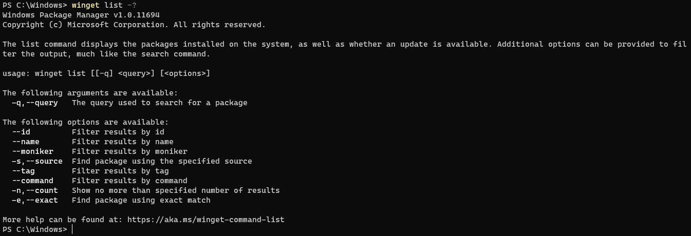
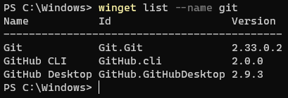
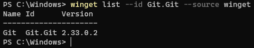
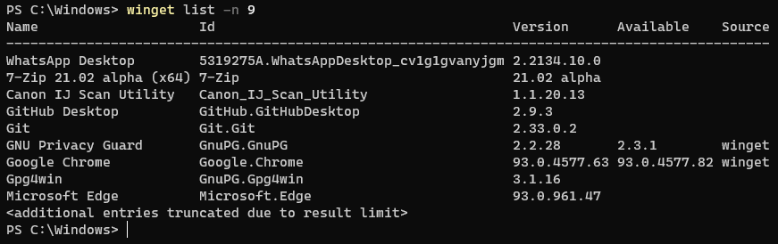
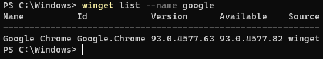

# list command (winget)

The **list** command of the [winget](index.md) tool displays the packages installed on the system, as well as whether an upgrade is available. The **list** command shows packages that were installed through Windows Package Manager as well as packages installed by other means.

The **list** command also supports filters that can be used to limit the results.

## Usage

`winget list [[-q] <query>] [<options>]`

The following command aliases are available: \
`ls`



## Arguments

The following arguments are available.

| Argument | Description |
|-------------|-------------|
| **-q, --query** | The query used to search for a package. |

## Options

The options allow you to customize the list experience to meet your needs.

| Option | Description |
|--------|-------------|
| **--id** | Filter results by id. |
| **--name** | Filter results by name. |
| **--moniker** | Filter results by moniker. |
| **-s, --source** | Find package using the specified source. |
| **--tag** | Filter results by tag. |
| **--cmd, --command** | Filter results by command. |
| **-n, --count** | Show no more than the specified number of results (between 1 and 1000). |
| **-e, --exact** | Find package using exact match. |
| **--scope** | Select installed package scope filter (user or machine). |
| **--header** | Optional Windows-Package-Manager REST source HTTP header. |
| **--authentication-mode** | Specify authentication window preference (`silent`, `silentPreferred`, or `interactive`). |
| **--authentication-account** | Specify the account to be used for authentication. |
| **--accept-source-agreements** | Accept all source agreements during source operations. |
| **--upgrade-available** | Lists only packages which have an upgrade available. |
| **-u, --unknown, --include-unknown** | List packages even if their current version cannot be determined. Can only be used with the **--upgrade-available** argument. |
| **--pinned, --include-pinned** | List packages even if they have a pin that prevents upgrade. Can only be used with the **--upgrade-available** argument. |
| **--details** | Show detailed information about packages. |
| **--sort** | Sort results by a property. Can be repeated for multi-field sorting. |
| **--asc, --ascending** | Sort results in ascending order. |
| **--desc, --descending** | Sort results in descending order. |
| **-?, --help** | Shows help about the selected command. |
| **--wait** | Prompts the user to press any key before exiting. |
| **--logs, --open-logs** | Open the default logs location. |
| **--verbose, --verbose-logs** | Enables verbose logging for winget. |
| **--nowarn, --ignore-warnings** | Suppresses warning outputs. |
| **--disable-interactivity** | Disable interactive prompts. |
| **--proxy** | Set a proxy to use for this execution. |
| **--no-proxy** | Disable the use of proxy for this execution. |

### Example queries

The following example lists a specific application by name.



The following example lists an application by ID from a specific source.



The following example limits the output of list to 9 apps.



## Sorting output

By default, results are sorted by name in ascending order. When a query argument is used, results preserve relevance ordering from the package source unless you override it.

### Sort via command-line arguments

Use `--sort` to sort by one or more fields. When multiple `--sort` options are specified, results are sorted by the first field, then ties are broken by the second field, and so on.

```cmd
winget list --sort name
winget list --sort source --sort name
winget list --sort name --descending
```

### Sort via user settings

You can set a default sort order in your [settings](https://aka.ms/winget-settings) under `output.sortOrder`:

```json
{
    "output": {
        "sortOrder": ["source", "name"]
    }
}
```

An empty array (`[]`) results in default sorting.

## List with update

The **list** command can show apps that have updates available.

In the image below, you will notice the current version of **Google Chrome** has an update available.



## Related topics

* [Use the winget tool to install and manage applications](index.md)
