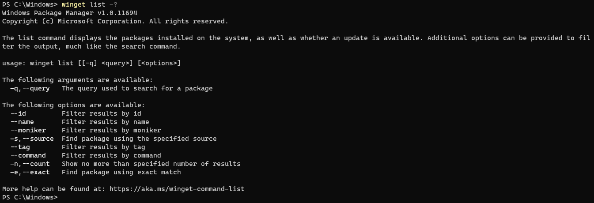
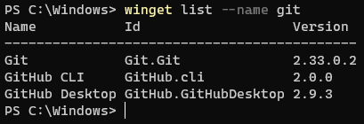
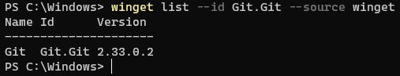
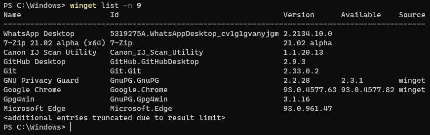

# list command (winget)

The **list** command of the [winget](index.md) tool displays a list of the applications currently installed on your computer.  The list command will show apps that were installed through the Windows Package Manager as well as apps that were installed by other means.

In addition, the **list** command will also display if an update is available for an app, and you can use the [**upgrade**](upgrade.md) command to update the app.

The **list** command also supports filters which can be used to limit your list query.

## Usage

`winget list [[-q] <query>] [<options>]`

The following command aliases are available: \
`ls`

## Arguments

The following arguments are available.

| Argument | Description |
|-------------|-------------|
| **-q,--query** | The query used to search for an app. |

## Options

The options allow you to customize the list experience to meet your needs.
| Option | Description |
|--------|-------------|
| **--id** | Limits the list to the ID of the application. |
| **--name** | Limits the list to the name of the application. |
| **--moniker** | Limits the list to the moniker listed for the application. |
| **-s, --source** | Restricts the list to the source name provided. Must be followed by the source name. |
| **--tag** | Filters results by tags. |
| **--command** | Filters results by command specified by the application. |
| **-n, --count** | Limits the number of apps displayed in one query. |
| **-e, --exact** | Uses the exact string in the list query, including checking for case-sensitivity. It will not use the default behavior of a substring. |
| **--scope** | Select installed package scope filter (user or machine). |
| **--header** | Optional Windows-Package-Manager REST source HTTP header. |
| **--accept-source-agreements** | Accept all source agreements during source operations. |
| **--upgrade-available** | Lists only packages which have an upgrade available. |
| **-u,--unknown,--include-unknown** | List packages even if their current version cannot be determined. Can only be used with the --upgrade-available argument. |
| **--pinned,--include-pinned** | List packages even if they have a pin that prevents upgrade. Can only be used with the --upgrade-available argument. |
| **-?,--help** | Get additional help on this command. |
| **--wait** | Prompts the user to press any key before exiting. |
| **--logs,--open-logs** | Open the default logs location. |
| **--verbose,--verbose-logs** | Enables verbose logging for winget. |
| **--disable-interactivity** | Disable interactive prompts. |

### Example queries

The following example lists a specific version of an application.

The following example lists all application by ID from a specific source.

The following example limits the output of list to 9 apps.

## List with Update

As stated above, the **list** command allows you to see what apps you have installed that have updates available.

In the image below, you will notice the current version of **Google Chrome** has an update available.

The **list** command will show not only the update version available, but the source that the update is available from.

## Related topics

* [Use the winget tool to install and manage applications](index.md)
