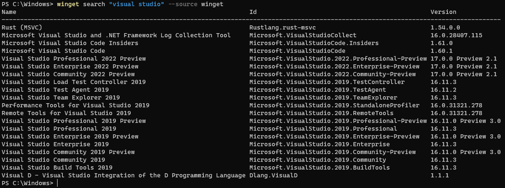

# search command (winget)

The **search** command of the [winget](index.md) tool queries the sources for available applications that can be installed.

The **search** command can show all applications available, or it can be filtered down to a specific application. The **search** command is typically used to identify the string to use to install a specific application.

## Usage

`winget search [[-q] <query>] [<options>]`

The following command aliases are available: \
`find`

## Arguments

The following arguments are available.

| Argument | Description |
|--------------|-------------|
| **-q, --query** | The query used to search for a package. |

## Show all

If the search command includes no filters or options, it will display all available applications in the default source. You can also search for all applications in another source if you pass in just the **source** option.

## Options

| Option | Description |
|--------------|-------------|
| **--id** | Filter results by id. |
| **--name** | Filter results by name. |
| **--moniker** | Filter results by moniker. |
| **--tag** | Filter results by tag. |
| **--cmd, --command** | Filter results by command. |
| **-s, --source** | Find package using the specified source. |
| **-n, --count** | Show no more than the specified number of results (between 1 and 1000). |
| **-e, --exact** | Find package using exact match. |
| **--header** | Optional Windows-Package-Manager REST source HTTP header. |
| **--authentication-mode** | Specify authentication window preference (`silent`, `silentPreferred`, or `interactive`). |
| **--authentication-account** | Specify the account to be used for authentication. |
| **--accept-source-agreements** | Accept all source agreements during source operations. |
| **--versions** | Show available versions of the package. |
| **-?, --help** | Shows help about the selected command. |
| **--wait** | Prompts the user to press any key before exiting. |
| **--logs, --open-logs** | Open the default logs location. |
| **--verbose, --verbose-logs** | Enables verbose logging for winget. |
| **--nowarn, --ignore-warnings** | Suppresses warning outputs. |
| **--disable-interactivity** | Disable interactive prompts. |
| **--proxy** | Set a proxy to use for this execution. |
| **--no-proxy** | Disable the use of proxy for this execution. |

The string will be treated as a substring. The search by default is also case-insensitive. For example, `winget search micro` could return results such as `Microsoft`, `Microscope`, or `MyMicro`.

## Related topics

* [Use the winget tool to install and manage applications](index.md)
