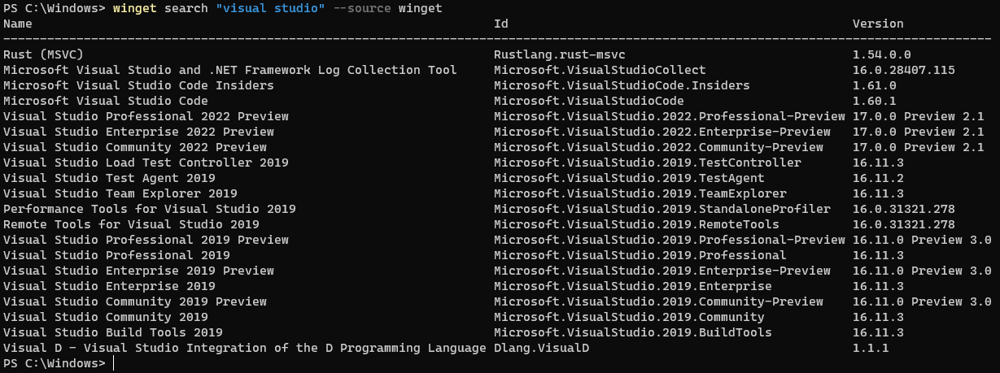

# search command (winget)

The **search** command of the [winget](index.md) tool queries the sources for available applications that can be installed.

The **search** command can show all applications available, or it can be filtered down to a specific application. The **search** command is used typically to identify the string to use to install a specific application.

## Usage

`winget search [[-q] <query>] [<options>]`

The following command aliases are available: \
`find`

## Arguments

The following arguments are available.

| Argument  | Description |
 --------------|-------------|
| **-q, --query** |  The query used to search for an app. |

## Show all

If the search command includes no filters or options, it will display all available applications in the default source. You can also search for all applications in another source if you pass in just the **source** option.

## Search strings

Search strings can be filtered with the following options.

| Option  | Description |
 --------------|-------------|
| **--id** | Limits the search to the ID of the application. The ID includes the publisher and the application name. |
| **--name** | Limits the search to the name of the application. |
| **--moniker** | Limits the search to the moniker specified. |
| **--tag** | Limits the search to the tags listed for the application. |
| **--cmd, --command** | Limits the search to the commands listed for the application. |
| **-s, --source** | Find package using the specified source. |
| **-n, --count** | Show no more than specified number of results (between 1 and 1000). |
| **-e, --exact** | Find package using exact match. |
| **--header** | Optional Windows-Package-Manager REST source HTTP header. |
| **--accept-source-agreements** | Accept all source agreements during source operations. |
| **--versions** | Show available versions of the package. |
| **-?, --help** | Gets additional help on this command. |
| **--wait** | Prompts the user to press any key before exiting. |
| **--logs, --open-logs** | Open the default logs location. |
| **--verbose, --verbose-logs** | Enables verbose logging for winget. |
| **--disable-interactivity** | Disable interactive prompts. |

The string will be treated as a substring. The search by default is also case insensitive. For example, `winget search micro` could return the following:

* Microsoft
* Microscope
* MyMicro

## Search options

The search commands supports a number of options or filters to help limit the results.

| Option  | Description |
 --------------|-------------|
| **-e, --exact** | Uses the exact string in the query, including checking for case-sensitivity. It will not use the default behavior of a substring. |
| **-n, --count** | Restricts the output of the display to the specified count. |
| **-s, --source** | Restricts the search to the specified [source](source.md) name. |

## Related topics

* [Use the winget tool to install and manage applications](index.md)
