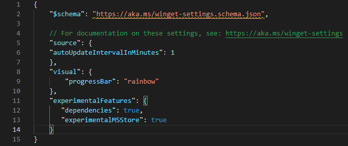

# settings command (winget)

The **settings** command of the [winget](index.md) tool opens settings in the default JSON text editor. If no editor is configured, it opens settings in Notepad. For available settings, see [https://aka.ms/winget-settings](https://aka.ms/winget-settings).

This command can also be used to set administrator settings by providing the **--enable** or **--disable** arguments, or by using the **export**, **set**, and **reset** subcommands.

## Usage

Launch your default JSON editing tool: `winget settings`

Manage admin settings: `winget settings [<command>] [<options>]`

The following command aliases are available: `config`

## Sub-commands

| Sub-command | Description |
|-------------|-------------|
| **export** | Export settings as JSON. |
| **set** | Sets the value of an admin setting. |
| **reset** | Resets an admin setting to its default value. |

## Options

| Option | Description |
|--------|-------------|
| **--enable** | Enables the specific administrator setting. |
| **--disable** | Disables the specific administrator setting. |
| **-?, --help** | Shows help about the selected command. |
| **--wait** | Prompts the user to press any key before exiting. |
| **--logs, --open-logs** | Open the default logs location. |
| **--verbose, --verbose-logs** | Enables verbose logging for winget. |
| **--nowarn, --ignore-warnings** | Suppresses warning outputs. |
| **--disable-interactivity** | Disable interactive prompts. |
| **--proxy** | Set a proxy to use for this execution. |
| **--no-proxy** | Disable the use of proxy for this execution. |

## Sub-command details

### export

Usage: `winget settings export [<options>]`

Exports settings as JSON.

### set

Usage: `winget settings set [--setting] <setting> [--value] <value> [<options>]`

| Argument | Description |
|--------|-------------|
| **--setting** | Name of the setting to modify. |
| **--value** | Value to set for the setting. |

### reset

Usage: `winget settings reset [[--setting] <setting>] [<options>]`

| Argument or option | Description |
|--------|-------------|
| **--setting** | Name of the setting to modify. |
| **-r, --recurse, --all** | Resets all admin settings. |

## Related topics

* [Use the winget tool to install and manage applications](index.md)
