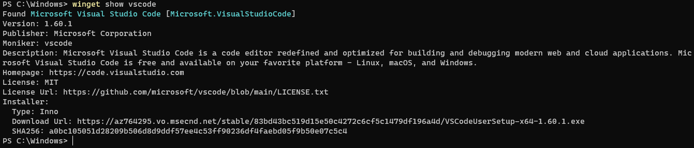

# show command (winget)

The **show** command of the [winget](index.md) tool displays details for the specified application, including details on the source of the application as well as the metadata associated with the application.

The **show** command only shows metadata that was submitted with the application. If the submitted application excludes some metadata, then the data will not be displayed.

## Usage

`winget show [[-q] <query>] [<options>]`

The following command aliases are available: \
`view`

## Arguments

The following arguments are available.

| Argument  | Description |
|--------------|-------------|
| **-q, --query** | The query used to search for a package. |

## Options

The following options are available.

| Option  | Description |
|--------------|-------------|
| **-m, --manifest** | The path to the manifest of the package. |
| **--id** | Filter results by id. |
| **--name** | Filter results by name. |
| **--moniker** | Filter results by moniker. |
| **-v, --version** | Use the specified version; default is the latest version. |
| **-s, --source** | Find package using the specified source. |
| **-e, --exact** | Find package using exact match. |
| **--scope** | Select install scope (user or machine). |
| **-a, --architecture** | Select the architecture. |
| **--installer-type** | Select the installer type. |
| **--locale** | Locale to use (BCP47 format). |
| **--versions** | Show available versions of the package. |
| **--header** | Optional Windows-Package-Manager REST source HTTP header. |
| **--authentication-mode** | Specify authentication window preference (`silent`, `silentPreferred`, or `interactive`). |
| **--authentication-account** | Specify the account to be used for authentication. |
| **--accept-source-agreements** | Accept all source agreements during source operations. |
| **-?, --help** | Shows help about the selected command. |
| **--wait** | Prompts the user to press any key before exiting. |
| **--logs, --open-logs** | Open the default logs location. |
| **--verbose, --verbose-logs** | Enables verbose logging for winget. |
| **--nowarn, --ignore-warnings** | Suppresses warning outputs. |
| **--disable-interactivity** | Disable interactive prompts. |
| **--proxy** | Set a proxy to use for this execution. |
| **--no-proxy** | Disable the use of proxy for this execution. |

## Multiple selections

If the query provided to **winget** does not result in a single application, then **winget** will display the results of the search. This will provide you with the additional data necessary to refine the search.

## Results of show

If a single application is detected, the following data will be displayed.

### Metadata

| Value  | Description |
|--------------|-------------|
| **Version** | Version of the application. |
| **Publisher** | Publisher of the application. |
| **Moniker** | AppMoniker of the application. |
| **Description** | Description of the application. |
| **Homepage**  | Homepage of the application. |
| **License**  | License of the application. |
| **LicenseUrl** | The URL to the license file of the application. |

### Installer details

| Value  | Description |
|--------------|-------------|
| **Type**  | The type of installer. |
| **Download Url** | The URL of the installer. |
| **SHA256** | The SHA-256 of the installer. |

## Related topics

* [Use the winget tool to install and manage applications](index.md)
