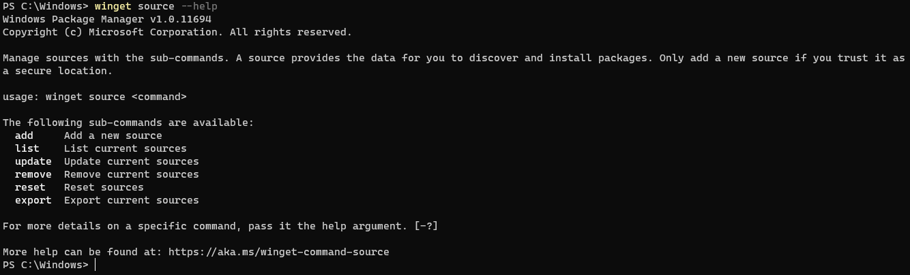

# source command (winget)

[!INCLUDE [preview-note](../../includes/package-manager-preview.md)]

> [!NOTE]
> The **source** command is currently for internal use only. Additional sources are not supported at this time.

The **source** command of the [winget](index.md) tool manages the repositories accessed by Windows Package Manager. With the **source** command you can **add**, **remove**, **list**, and **update** the repositories.

A source provides the data for you to discover and install applications. Only add a new source if you trust it as a secure location.

## Usage

`winget source \<sub command> \<options>`



## Arguments

The following arguments are available.

| Argument  | Description |
|--------------|-------------|
| **-?, --help** |  Gets additional help on this command. |

## Sub commands

Source supports the following sub commands for manipulating the sources.

| Sub command  | Description |
|--------------|-------------|
|  **add** |  Adds a new source. |
|  **list** | Enumerates the list of enabled sources. |
|  **update** | Updates a source. |
|  **remove** | Removes a source. |
|  **reset** | Resets **winget** back to the initial configuration.  |

## Options

The  **source** command supports the following options.

| Option  | Description |
|--------------|-------------|
|  **-n,--name** | The name to identify the source by. |
|  **-a,--arg** | The URL or UNC of the source. |
|  **-t,--type** | The type of source. |
| **-?, --help** |  Gets additional help on this command. |

## add

The **add** sub command adds a new source. This sub command requires the **--name** option and the **name** argument.

Usage: `winget source add [-n, --name] \<name> [-a] \<url> [[-t] \<type>]`

Example:  `winget source add --name Contoso  https://www.contoso.com/cache`

The **add** sub command also supports the optional **type** parameter. The **type** parameter communicates to the client what type of repository it is connecting to. The following types are supported.

| Type  | Description |
|--------------|-------------|
| **Microsoft.PreIndexed.Package** | The type of source \<default>. |

## list

the **list** sub command enumerates the currently enabled sources. This sub-command also provides details on a specific source.

Usage: `winget source list [-n, --name] \<name>`

### list all

The **list** sub-command by itself will reveal the complete list of supported sources. For example:

```CMD
> C:\winget source list
> Name   Arg
> -----------------------------------------
> winget https://winget.azureedge.net/cache

```

### list source details

In order to get complete details on the source, pass in the name used to identify the source. For example:

```CMD
> C:\winget source list --name contoso  
> Name   : contoso  
> Type   : Microsoft.PreIndexed.Package  
> Arg    : https://pkgmgr-int.azureedge.net/cache  
> Data   : AppInstallerSQLiteIndex-int_g4ype1skzj3jy  
> Updated: 2020-4-14 17:45:32.000
```

**Name** displays the name to identify the source by.
**Type** displays the type of repo.
**Arg** displays the URL or path used by the source.
**Data** displays the optional package name used if appropriate.
**Updated** displays the last date and time the source was updated.

## update

The **update** sub command forces an update to an individual source or for all.

usage: `winget source update [-n, --name] \<name>`

### update all

The **update** sub command by itself will request and update to each repo. For example: `C:\winget update`

### update source

The **update** sub command combined with the **--name** option can direct and update to an individual source. For example:  `C:\winget source update --name contoso`

## remove

The **remove** sub command removes a source. This sub command requires the **--name** option and **name argument** in order to identify the source.

Usage: `winget source remove [-n, --name] \<name>`

For example: `winget source remove --name Contoso`

## reset

The **reset** sub-command resets the client back to its original configuration. The **reset** sub-command removes all sources and sets the source to the default. This sub command should only be used in rare cases.

Usage: `winget source reset`

For example: `winget source reset`

## Default repository

Windows Package Manager specifies a default repository. You can identify the repository by using the **list** command. For example: `winget source list`

## Related topics

* [Use the winget tool to install and manage applications](index.md)
