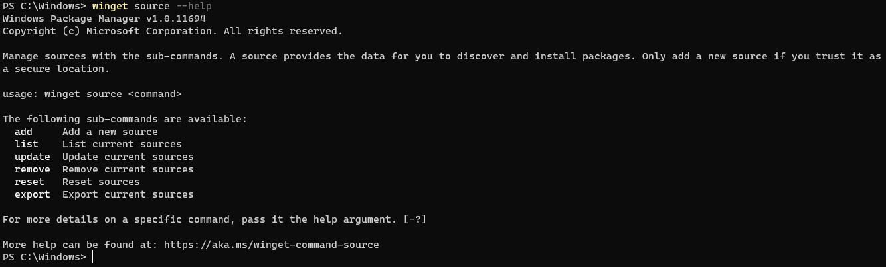
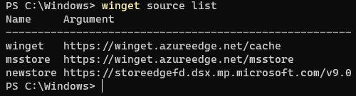
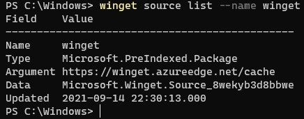

# source command (winget)

The **source** command of the [winget](index.md) tool manages the repositories accessed by Windows Package Manager. With the **source** command you can add, remove, list, update, edit, reset, and export sources.

A source provides the data for you to discover and install applications. Only add a new source if you trust it as a secure location.

## Usage

`winget source [<command>] [<options>]`

## Sub-commands

Source supports the following sub-commands for manipulating sources.

| Sub-command | Description |
|--------------|-------------|
| **add** | Add a new source. |
| **list** | List current sources. |
| **update** | Update current sources. |
| **remove** | Remove current sources. |
| **edit** | Edit properties of a source. |
| **reset** | Reset sources. |
| **export** | Export current sources. |

For more details on a specific command, pass it the help argument. [-?]

## Options

The **source** command supports the following options.

| Option | Description |
|--------------|-------------|
| **-?, --help** | Shows help about the selected command. |
| **--wait** | Prompts the user to press any key before exiting. |
| **--logs, --open-logs** | Open the default logs location. |
| **--verbose, --verbose-logs** | Enables verbose logging for winget. |
| **--nowarn, --ignore-warnings** | Suppresses warning outputs. |
| **--disable-interactivity** | Disable interactive prompts. |
| **--proxy** | Set a proxy to use for this execution. |
| **--no-proxy** | Disable the use of proxy for this execution. |

## add

The **add** sub-command adds a new source.

Usage: `winget source add [-n] <name> [-a] <arg> [[-t] <type>] [<options>]`

| Argument or option | Description |
|--------------|-------------|
| **-n, --name** | Name of the source. |
| **-a, --arg** | Argument given to the source. |
| **-t, --type** | Type of the source. |
| **--trust-level** | Trust level of the source (`none` or `trusted`). |
| **--header** | Optional Windows-Package-Manager REST source HTTP header. |
| **--accept-source-agreements** | Accept all source agreements during source operations. |
| **--explicit** | Excludes a source from discovery unless specified. |

Example: `winget source add --name Contoso --arg https://www.contoso.com/cache`

## list

The **list** sub-command lists all current sources, or full details of a specific source.

Usage: `winget source list [[-n] <name>] [<options>]`

The following command aliases are available: `ls`

### list all

The **list** sub-command by itself reveals the complete list of supported sources. For example:

### list source details

To get complete details about a source, pass in the name used to identify the source. For example:

**Name** displays the name used to identify the source. \
**Type** displays the type of repository. \
**Arg** displays the URL or path used by the source. \
**Data** displays the optional package name used if appropriate. \
**Updated** displays the last date and time the source was updated.

## update

The **update** sub-command updates all sources, or only a specific source.

Usage: `winget source update [[-n] <name>] [<options>]`

The following command aliases are available: `refresh`

## remove

The **remove** sub-command removes a specific source.

Usage: `winget source remove [-n] <name> [<options>]`

The following command aliases are available: `rm`

## edit

The **edit** sub-command edits properties of an existing source.

Usage: `winget source edit [-n] <name> [<options>]`

The following command aliases are available: `config`, `set`

| Option | Description |
|--------------|-------------|
| **-e, --explicit** | Excludes a source from discovery (`true` or `false`). |

## reset

The **reset** sub-command drops existing sources. Without any argument, it drops all sources and adds the defaults. If a named source is provided, only that source is dropped.

Usage: `winget source reset [[-n] <name>] [<options>]`

| Argument or option | Description |
|--------------|-------------|
| **-n, --name** | Name of the source. |
| **--force** | Forces the reset of the sources. |

## export

The **export** sub-command exports current sources as JSON for Group Policy.

Usage: `winget source export [[-n] <name>] [<options>]`

| Argument | Description |
|--------------|-------------|
| **-n, --name** | Name of the source. |

## Related topics

* [Use the winget tool to install and manage applications](index.md)
