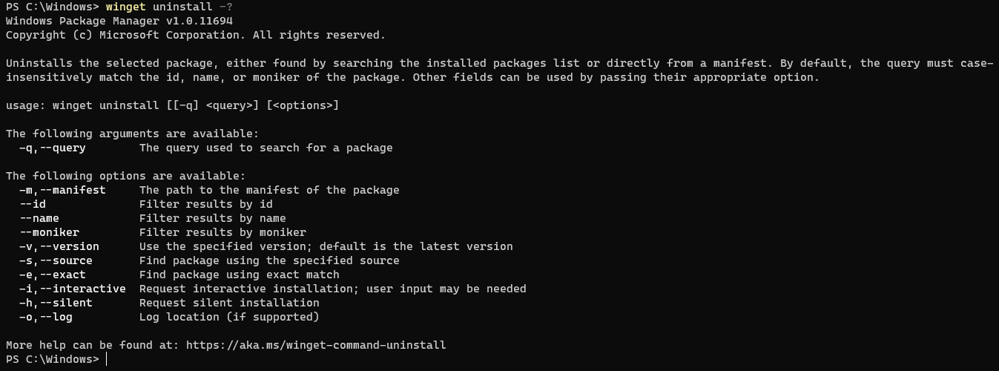
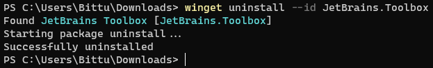
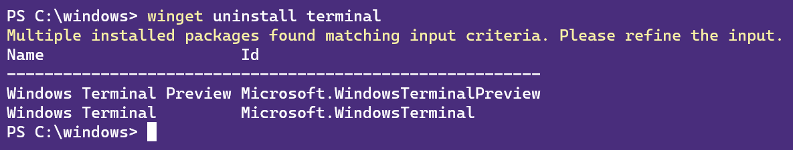
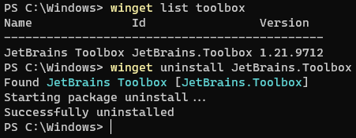

# uninstall command (winget)

The **uninstall** command of the [winget](index.md) tool uninstalls the specified application.

The **uninstall** command requires that you specify the exact string to uninstall. If there is any ambiguity, you will be prompted to further filter the **uninstall** command to an exact application.

## Usage

`winget uninstall [[-q] <query>...] [<options>]`

The following command aliases are available: \
`remove` \
`rm`



## Arguments

The following arguments are available.

| Argument | Description |
|-------------|-------------|
| **-q,--query**  |  The query used to search for an app. |

## Options

The options allow you to customize the uninstall experience to meet your needs.

| Option | Description |
|--------|-------------|
| **-m, --manifest** | Must be followed by the path to the manifest (YAML) file. You can use the manifest to run the uninstall experience from a [local YAML file](#local-uninstall). |
| **--id** | Limits the uninstall to the ID of the application. |
| **--name** | Limits the search to the name of the application. |
| **--moniker** | Limits the search to the moniker listed for the application. |
| **-v, --version** | Enables you to specify an exact version to uninstall. If not specified, the latest will uninstall the highest versioned application. |
| **-s, --source** | Restricts the search to the source name provided. Must be followed by the source name. |
| **-e, --exact** | Uses the exact string in the query, including checking for case-sensitivity. It will not use the default behavior of a substring. |
| **-i, --interactive** | Runs the uninstaller in interactive mode. The default experience shows uninstaller progress. |
| **-h, --silent** | Runs the uninstaller in silent mode. This suppresses all UI. The default experience shows uninstaller progress. |
| **-o, --log** | Directs the logging to a log file. You must provide a path to a file that you have the write rights to. |
| **--product-code** | Filters using the product code. |
| **--scope** | Select installed package scope filter (user or machine). |
| **--force** | Directly run the command and continue with non-security-related issues. |
| **--purge** | Deletes all files and directories in the package directory (portable). |
| **--preserve** | Retains all files and directories created by the package (portable). |
| **--header** | Optional Windows-Package-Manager REST source HTTP header. |
| **--accept-source-agreements** | Accept all source agreements during source operations. |
| **-?, --help** | Get additional help on this command. |
| **--wait** | Prompts the user to press any key before exiting. |
| **--logs, --open-logs** | Open the default logs location. |
| **--verbose, --verbose-logs** | Enables verbose logging for winget. |
| **--disable-interactivity** | Disable interactive prompts. |

Once you have successfully identified the application intended to uninstall, winget will execute the uninstall command.  In the example below, the **name** 'orca' and the **id** was passed in.




### Example queries

The following example uninstalls a specific version of an application.

```CMD
winget uninstall --name powertoys --version 0.15.2
```

The following example uninstalls an application using its ID.

```CMD
winget uninstall --id "{24559D0F-481C-F3BE-8DD0-D908923A38F8}"
```

## Multiple selections

If the query provided to **winget** does not result in a single application to uninstall, then **winget** will display multiple results. You can then use additional filters to refine the search for a correct application.



## Uninstalling apps not installed with Windows Package Manager
As mentioned in [**list**](list.md), the **winget list** command will display more than just apps installed with the **winget**.  Therefore you can use these commands to quickly and easily remove apps from your PC.

In this example, **list** was used to find the application, and then the **id** was passed in as part of uninstall.



## Related topics

* [Use the winget tool to install and manage applications](index.md)
