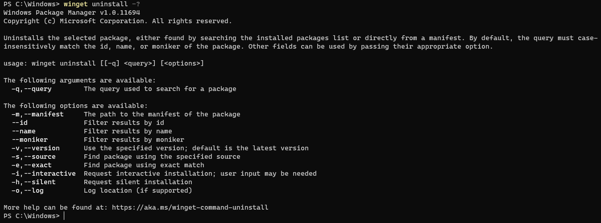
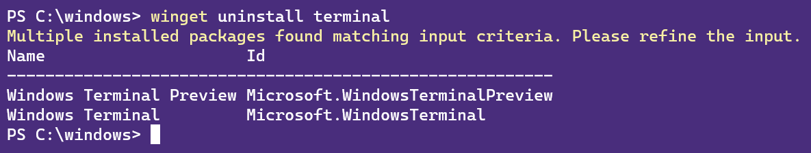

# uninstall command (winget)

The **uninstall** command of the [winget](index.md) tool uninstalls the specified application.

The **uninstall** command requires that you specify the exact string to uninstall. If there is any ambiguity, you will be prompted to further filter the **uninstall** command to an exact application.

## Usage

`winget uninstall [[-q] <query>...] [<options>]`

The following command aliases are available: \
`remove` \
`rm`



## Arguments

The following arguments are available.

| Argument | Description |
|-------------|-------------|
| **-q, --query** | The query used to search for a package. |

## Options

The options allow you to customize the uninstall experience to meet your needs.

| Option | Description |
|--------|-------------|
| **-m, --manifest** | The path to the manifest of the package. |
| **--id** | Filter results by id. |
| **--name** | Filter results by name. |
| **--moniker** | Filter results by moniker. |
| **--product-code** | Filters using the product code. |
| **-v, --version** | The version to act upon. |
| **--all, --all-versions** | Uninstall all versions. |
| **-s, --source** | Find package using the specified source. |
| **-e, --exact** | Find package using exact match. |
| **--scope** | Select installed package scope filter (user or machine). |
| **-i, --interactive** | Request interactive installation; user input may be needed. |
| **-h, --silent** | Request silent installation. |
| **--force** | Direct run the command and continue with non security related issues. |
| **--purge** | Deletes all files and directories in the package directory (portable). |
| **--preserve** | Retains all files and directories created by the package (portable). |
| **-o, --log** | Log location (if supported). |
| **--header** | Optional Windows-Package-Manager REST source HTTP header. |
| **--authentication-mode** | Specify authentication window preference (`silent`, `silentPreferred`, or `interactive`). |
| **--authentication-account** | Specify the account to be used for authentication. |
| **--accept-source-agreements** | Accept all source agreements during source operations. |
| **-?, --help** | Shows help about the selected command. |
| **--wait** | Prompts the user to press any key before exiting. |
| **--logs, --open-logs** | Open the default logs location. |
| **--verbose, --verbose-logs** | Enables verbose logging for winget. |
| **--nowarn, --ignore-warnings** | Suppresses warning outputs. |
| **--disable-interactivity** | Disable interactive prompts. |
| **--proxy** | Set a proxy to use for this execution. |
| **--no-proxy** | Disable the use of proxy for this execution. |

### Example queries

The following example uninstalls a specific version of an application.

```CMD
winget uninstall --name powertoys --version 0.15.2
```

The following example uninstalls an application using its ID.

```CMD
winget uninstall --id Microsoft.PowerToys
```

## Multiple selections

If the query provided to **winget** does not result in a single application to uninstall, then **winget** will display multiple results. You can then use additional filters to refine the search for a correct application.



## Uninstalling apps not installed with Windows Package Manager

As mentioned in [**list**](list.md), the **winget list** command displays more than just apps installed with **winget**. Therefore, you can use these commands to quickly remove apps from your PC.

## Related topics

* [Use the winget tool to install and manage applications](index.md)
