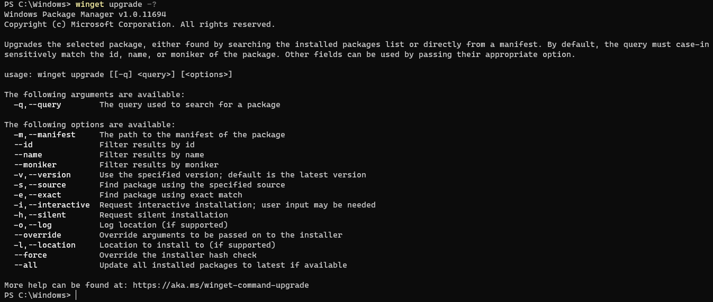
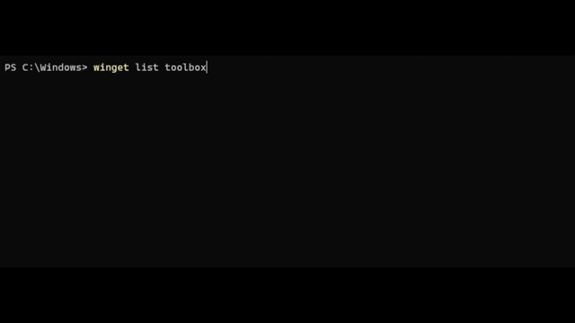

# upgrade command (winget)

[!INCLUDE [preview-note](../../includes/package-manager-preview.md)]

The **upgrade** command of the [winget](index.md) tool upgrades the specified application. Optionally, you may use the [**list**](.\list.md) command to identify the application you want to upgrade.  

The **upgrade** command requires that you specify the exact string to upgrade. If there is any ambiguity, you will be prompted to further filter the **upgrade** command to  an exact application.

## Usage

`winget upgrade [[-q] \<query>] [\<options>]`



## Arguments

The following arguments are available.

| Argument      | Description |
|-------------|-------------|  
| **-q,--query**  |  The query used to search for an app. |
| **-?, --help** |  Get additional help on this command. |

## Options

The options allow you to customize the upgrade experience to meet your needs.

| Option      | Description |
|-------------|-------------|  
| **-m, --manifest** |   Must be followed by the path to the manifest (YAML) file. You can use the manifest to run the upgrade experience from a [local YAML file](#local-upgrade). |
| **--id**    |  Limits the upgrade to the ID of the application.   |  
| **--name**   |  Limits the search to the name of the application. |  
| **--moniker**   | Limits the search to the moniker listed for the application. |  
| **-v, --version**  |  Enables you to specify an exact version to upgrade. If not specified, latest will upgrade the highest versioned application. |  
| **-s, --source**   |  Restricts the search to the source name provided. Must be followed by the source name. |  
| **-e, --exact**   |   Uses the exact string in the query, including checking for case-sensitivity. It will not use the default behavior of a substring. |  
| **-i, --interactive** |  Runs the installer in interactive mode. The default experience shows installer progress. |  
| **-h, --silent** |  Runs the installer in silent mode. This suppresses all UI. The default experience shows installer progress. |  
| **-o, --log**  |  Directs the logging to a log file. You must provide a path to a file that you have the write rights to. |
| **--override** | A string that will be passed directly to the installer.    |
| **-l, --location** |    Location to upgrade to (if supported). |
| **--force** | When a hash mismatch is discovered will ignore the error and attempt to install the package.    |
| **--all** | Updates all available packages to the latest application. |
### Example queries

The following example upgrades a specific version of an application.

```CMD
winget upgrade powertoys --version 0.15.2
```

The following example upgrades an application from its ID.

```CMD
winget upgrade --id Microsoft.PowerToys
```

The following example shows upgrading all apps

```CMD
winget upgrade --all
```

## Using **list** and **upgrade**

It is common to use the [**list**](.\list.md) command to identify apps in need of an update, and then to use **upgrade** to install the latest.

In the example below you will see [**list**](.\list.md) identifies that an update is available for Microsoft.WindowsTerminalPreview, and then the user uses **upgrade** to update the application.



## **upgrade** --all

**upgrade --all** will identify all the applications with upgrades available. When you run **winget upgrade --all** the Windows Package Manager will look for all applications that have updates available and attempt to install the.

>[!NOTE]
Some applications do not provide a version.  They are always latest.  Because the Windows Package Manager cannot identify if their is a newer version of the app, an upgrade will not be possible.
