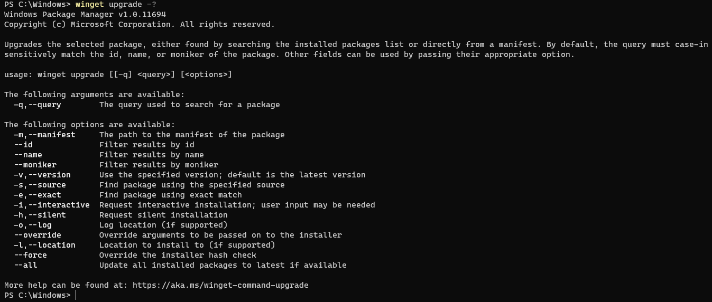
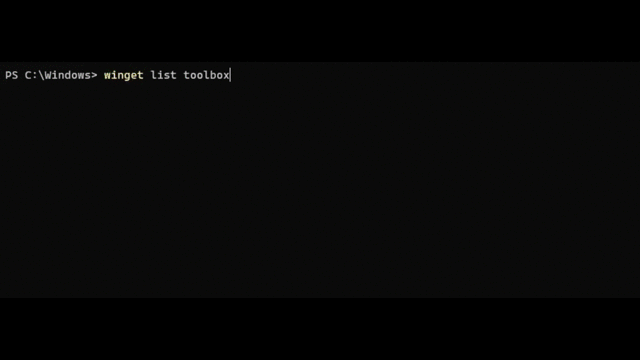

# upgrade command (winget)

The **upgrade** command of the [winget](index.md) tool upgrades the specified application. When no arguments are given, it shows the packages that have upgrades available.

The **upgrade** command requires that you specify the exact string to upgrade. If there is any ambiguity, you will be prompted to further filter the **upgrade** command to an exact application.

## Usage

`winget upgrade [[-q] <query>...] [<options>]`

The following command aliases are available: \
`update`



## Arguments

The following arguments are available.

| Argument | Description |
|-------------|-------------|
| **-q, --query** | The query used to search for a package. |

## Options

The options allow you to customize the upgrade experience to meet your needs.

| Option | Description |
|-------------|-------------|
| **-m, --manifest** | The path to the manifest of the package. You can use the manifest to run the upgrade experience from a local YAML file. |
| **--id** | Filter results by id. |
| **--name** | Filter results by name. |
| **--moniker** | Filter results by moniker. |
| **-v, --version** | Use the specified version; default is the latest version. |
| **-s, --source** | Find package using the specified source. |
| **-e, --exact** | Find package using exact match. |
| **-i, --interactive** | Request interactive installation; user input may be needed. |
| **-h, --silent** | Request silent installation. |
| **--purge** | Deletes all files and directories in the package directory (portable). |
| **-o, --log** | Log location (if supported). |
| **--custom** | Arguments to be passed on to the installer in addition to the defaults. |
| **--override** | Override arguments to be passed on to the installer. |
| **-l, --location** | Location to install to (if supported). |
| **--scope** | Select installed package scope filter (user or machine). |
| **-a, --architecture** | Select the architecture. |
| **--installer-type** | Select the installer type. |
| **--locale** | Locale to use (BCP47 format). |
| **--ignore-security-hash** | Ignore the installer hash check failure. |
| **--allow-reboot** | Allows a reboot if applicable. |
| **--skip-dependencies** | Skips processing package dependencies and Windows features. |
| **--ignore-local-archive-malware-scan** | Ignore the malware scan performed as part of installing an archive type package from local manifest. |
| **--accept-package-agreements** | Accept all license agreements for packages. |
| **--accept-source-agreements** | Accept all source agreements during source operations. |
| **--header** | Optional Windows-Package-Manager REST source HTTP header. |
| **--authentication-mode** | Specify authentication window preference (`silent`, `silentPreferred`, or `interactive`). |
| **--authentication-account** | Specify the account to be used for authentication. |
| **-r, --recurse, --all** | Upgrade all installed packages to latest if available. |
| **-u, --unknown, --include-unknown** | Upgrade packages even if their current version cannot be determined. |
| **--pinned, --include-pinned** | Upgrade packages even if they have a non-blocking pin. |
| **--uninstall-previous** | Uninstall the previous version of the package during upgrade. |
| **--force** | Direct run the command and continue with non security related issues. |
| **-?, --help** | Shows help about the selected command. |
| **--wait** | Prompts the user to press any key before exiting. |
| **--logs, --open-logs** | Open the default logs location. |
| **--verbose, --verbose-logs** | Enables verbose logging for winget. |
| **--nowarn, --ignore-warnings** | Suppresses warning outputs. |
| **--disable-interactivity** | Disable interactive prompts. |
| **--proxy** | Set a proxy to use for this execution. |
| **--no-proxy** | Disable the use of proxy for this execution. |

### Example queries

The following example upgrades a specific application to a specific version.

```CMD
winget upgrade powertoys --version 0.15.2
```

The following example upgrades an application from its ID.

```CMD
winget upgrade --id Microsoft.PowerToys
```

The following example upgrades all installed packages with upgrades available.

```CMD
winget upgrade --all
```

## Using **list** and **upgrade**

It is common to use the [**list**](list.md) command to identify apps in need of an update, and then to use **upgrade** to install the latest.

In the example below you will see [**list**](list.md) identifies that an update is available for **JetBrains.Toolbox**, and then the user uses **upgrade** to update the application.



## **upgrade** --all

**winget upgrade --all** identifies all the applications with upgrades available and attempts to install the upgrades.

## Related topics

* [Use the winget tool to install and manage applications](index.md)
