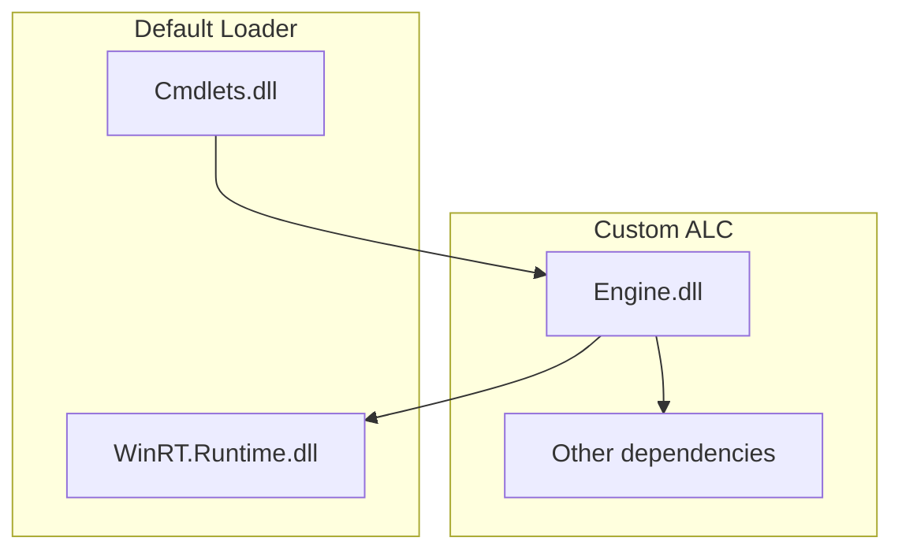

# Windows Package Manager Configuration PowerShell Module

The Windows Package Manager Configuration PowerShell Module is made up on two components

1. The `Microsoft.WinGet.Configuration.Cmdlets` project which contains cmdlet implementations.
2. The `Microsoft.WinGet.Configuration.Engine` project which contain the real logic for the cmdlets.

## Cmdlets
- Get-WinGetConfiguration
- Get-WinGetConfigurationDetails
- Invoke-WinGetConfiguration
- Start-WinGetConfiguration
- Complete-WinGetConfiguration

## Syntax 
```
Get-WinGetConfiguration -File <string> [<CommonParameters>]

Get-WinGetConfigurationDetails -Set <PSConfigurationSet> [<CommonParameters>]

Invoke-WinGetConfiguration -Set <PSConfigurationSet> [-AcceptConfigurationAgreements] [<CommonParameters>]

Start-WinGetConfiguration -Set <PSConfigurationSet> [-AcceptConfigurationAgreements] [<CommonParameters>]

Complete-WinGetConfiguration -ConfigurationJob <PSConfigurationJob> [<CommonParameters>]
```

## Prerequisites

Minimum PowerShell 7 version: 7.2.8

## Telemetry
Telemetry is enabled by default. To disable it one should set the POWERSHELL_TELEMETRY_OPTOUT env variable to “1”, “yes” or “true”.

## Building the PowerShell Module Locally
After building the Microsoft.WinGet.Configuration.Cmdlets project, the `Microsoft.WinGet.Configuration` PowerShell module can be found in the output directory in the `PowerShell` folder. For example if you built the project as x64 release, you should expect to find the module files in `$(SolutionDirectory)/src/x64/Release/PowerShell`.


## Adding a new cmdlet
In order to avoid [assembly dependency conflicts](https://learn.microsoft.com/en-us/powershell/scripting/dev-cross-plat/resolving-dependency-conflicts?view=powershell-7.3) this project uses a custom `AssemblyLoadContext` that load all dependencies.

Microsoft.WinGet.Configuration.Cmdlets.dll is the binary that gets loaded when the module is imported. When Microsoft.WinGet.Configuration.Engine.dll is getting loaded the resolving handler use the custom ALC to load it. Then all the dependencies of that binary will be loaded using that custom context.

The dependencies are laid out in two directories: `DirectDependencies` and `SharedDependencies`. The resolving handler looks for binaries under `DirectDependencies` and uses the custom ALC to load them. The custom ALC load any binaries in `DirectDependencies` and `SharedDependencies`.

Exception: WinRT.Runtime.dll doesn't support getting loaded in multiple times in the same process, because it affects static state in the CLR itself. We special case it to get loaded in by the default loader.

### Current layout.
```
Microsoft.WinGet.Configuration.Cmdlets.dll
DirectDependencies\Microsoft.WinGet.Configuration.Engine.dll
SharedDependencies\Microsoft.Management.Configuration.Processor.dll
SharedDependencies\Microsoft.Windows.SDK.NET.dll
SharedDependencies\WinRT.Runtime.dll
SharedDependencies\x64\Microsoft.Management.Configuration.dll
SharedDependencies\x64\Microsoft.Management.Configuration.Projection.dll
SharedDependencies\x86\Microsoft.Management.Configuration.dll
SharedDependencies\x86\Microsoft.Management.Configuration.Projection.dll
```
If the new cmdlet introduces a new dependency, please make sure to add it to the proper location in the AfterBuild tasks in Microsoft.WinGet.Configuration.Cmdlets.csproj.

### Dependency graph

