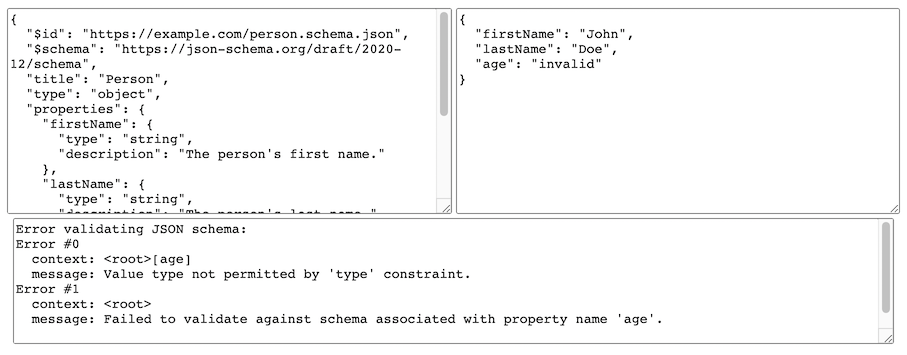

# Valijson

Valijson is a header-only [JSON Schema](http://json-schema.org/) validation library for C++11.

Valijson provides a simple validation API that allows you to load JSON Schemas, and validate documents loaded by one of several supported parser libraries.

## Project Goals

The goal of this project is to support validation of all constraints available in JSON Schema v7, while being competitive with the performance of a hand-written schema validator.

## Usage

Clone the repo, including submodules:

    git clone --recurse-submodules git@github.com:tristanpenman/valijson.git

The following code snippets show how you might implement a simple validator using RapidJson as the underlying JSON Parser.

Include the necessary headers:
```cpp
#include <valijson/adapters/rapidjson_adapter.hpp>
#include <valijson/utils/rapidjson_utils.hpp>
#include <valijson/schema.hpp>
#include <valijson/schema_parser.hpp>
#include <valijson/validator.hpp>
```
These are the classes that we'll be using:
```cpp
using valijson::Schema;
using valijson::SchemaParser;
using valijson::Validator;
using valijson::adapters::RapidJsonAdapter;
```
We are going to use RapidJSON to load the schema and the target document:
```cpp
// Load JSON document using RapidJSON with Valijson helper function
rapidjson::Document mySchemaDoc;
if (!valijson::utils::loadDocument("mySchema.json", mySchemaDoc)) {
    throw std::runtime_error("Failed to load schema document");
}

// Parse JSON schema content using valijson
Schema mySchema;
SchemaParser parser;
RapidJsonAdapter mySchemaAdapter(mySchemaDoc);
parser.populateSchema(mySchemaAdapter, mySchema);
```
Load a document to validate:
```cpp
rapidjson::Document myTargetDoc;
if (!valijson::utils::loadDocument("myTarget.json", myTargetDoc)) {
    throw std::runtime_error("Failed to load target document");
}
```

Validate a document:
```cpp
Validator validator;
RapidJsonAdapter myTargetAdapter(myTargetDoc);
if (!validator.validate(mySchema, myTargetAdapter, NULL)) {
    throw std::runtime_error("Validation failed.");
}
```

Note that Valijson's `SchemaParser` and `Validator` classes expect you to pass in a `RapidJsonAdapter` rather than a `rapidjson::Document`. This is due to the fact that `SchemaParser` and `Validator` are template classes that can be used with any of the JSON parsers supported by Valijson.

### Exceptions

By default, Valijson classes will not throw exceptions (e.g. when failing to parse a schema). To enable exceptions for these cases, `VALIJSON_USE_EXCEPTIONS` must be defined.
However note that `VALIJSON_USE_EXCEPTIONS` is defined as interface compile definition of the cmake target, and the definition populates all the targets linking Valijson with cmake.

### Strong vs Weak Types

Valijson has a notion of strong and weak typing. By default, strong typing is used. For example, the following will create a validator that uses strong typing:

```cpp
Validator validator;
```

This validator will not attempt to cast between types to satisfy a schema. So the string `"23"` will not be parsed as a number.

Alternatively, weak typing can be used:

```cpp
Validator validator(Validator::kWeakTypes);
```

This will create a validator that will attempt to cast values to satisfy a schema. The original motivation for this was to support the Boost Property Tree library, which can parse JSON, but stores values as strings.

## Memory Management

Valijson has been designed to safely manage, and eventually free, the memory that is allocated while parsing a schema or validating a document. When working with an externally loaded schema (i.e. one that is populated using the `SchemaParser` class) you can rely on RAII semantics.

Things get more interesting when you build a schema using custom code, as illustrated in the following snippet. This code demonstrates how you would create a schema to verify that the value of a 'description' property (if present) is always a string:
```cpp
{
    // Root schema object that manages memory allocated for
    // constraints or sub-schemas
    Schema schema;

    // Allocating memory for a sub-schema returns a const pointer
    // which allows inspection but not mutation. This memory will be
    // freed only when the root schema goes out of scope
    const Subschema *subschema = schema.createSubschema();

    {   // Limited scope, for example purposes

        // Construct a constraint on the stack
        TypeConstraint typeConstraint;
        typeConstraint.addNamedType(TypeConstraint::kString);

        // Constraints are added to a sub-schema via the root schema,
        // which will make a copy of the constraint
        schema.addConstraintToSubschema(typeConstraint, subschema);

        // Constraint on the stack goes out of scope, but the copy
        // held by the root schema continues to exist
    }

    // Include subschema in properties constraint
    PropertiesConstraint propertiesConstraint;
    propertiesConstraint.addPropertySubschema("description", subschema);

    // Add the properties constraint
    schema.addConstraint(propertiesConstraint);

    // Root schema goes out of scope and all allocated memory is freed
}
```
## JSON References

The library includes support for local JSON References. Remote JSON References are supported only when the appropriate callback functions are provided.

Valijson's JSON Reference implementation requires that two callback functions are required. The first is expected to return a pointer to a newly fetched document. Valijson takes ownership of this pointer. The second callback function is used to release ownership of that pointer back to the application. Typically, this would immediately free the memory that was allocated for the document.

## Test Suite

Valijson's' test suite currently contains several hand-crafted tests and uses the standard [JSON Schema Test Suite](https://github.com/json-schema/JSON-Schema-Test-Suite) to test support for parts of the JSON Schema feature set that have been implemented.

### cmake

The examples and test suite can be built using cmake:
```bash
# Build examples and test suite
mkdir build
cd build
cmake .. -Dvalijson_BUILD_TESTS=ON -Dvalijson_BUILD_EXAMPLES=ON
make

# Run test suite (from build directory)
./test_suite
```
## How to add this library to your cmake target

Valijson can be integrated either as git submodule or with find_package().

### Valijson as git submodule

Download this repository into your project

```bash
git clone --recurse-submodules https://github.com/tristanpenman/valijson <project-path>/third-party/valijson
```

If your project is a git repository

```bash
cd <project-path>
git submodule add https://github.com/tristanpenman/valijson third-party/valijson
```

Before the target add the module subdirectory in your CMakeLists.txt

```cmake
set(valijson_BUILD_TESTS OFF CACHE BOOL "don't build valijson tests")
add_subdirectory(third-party/valijson)

add_executable(your-executable ...)

target_link_libraries(your-executable ValiJSON::valijson)
```
### Install Valijson and import it

It is possible to install headers by running cmake's install command from the build tree. Once Valijson is installed, use it from other CMake projects using `find_package(Valijson)` in your CMakeLists.txt.
```bash
# Install Valijson
git clone --recurse-submodules --depth=1 git@github.com:tristanpenman/valijson.git
cd valijson
mkdir build
cd build
cmake ..
cmake --install .
```
```cmake
# Import installed valijson and link it to your executable
find_package(valijson REQUIRED)
add_executable(executable main.cpp)
target_link_libraries(executable valijson)
```

## Bundled Headers

An alternative way to include Valijson in your project is to generate a bundled header file, containing support for just one parser/adapter.

You can generate a header file using the `bundle.sh` script:

    ./bundle.sh nlohmann_json > valijson_nlohmann_bundled.hpp

This can then be used in your project with a single `#include`:

    #include "valijson_nlohmann_bundled.hpp"

An example can be found in [examples/valijson_nlohmann_bundled_test.cpp](examples/valijson_nlohmann_bundled_test.cpp).

Note: the bundled version of Valijson always embeds a compatibility header in place of `std::optional`.

## Examples

Building the Valijson Test Suite, using the instructions above, will also compile two example applications: `custom_schema` and `external_schema`.

`custom_schema` shows how you can hard-code a schema definition into an application, while `external_schema` builds on the example code above to show you how to validate and document and report on any validation errors.

## JSON Schema Support

Valijson supports most of the constraints defined in [Draft 7](https://json-schema.org/draft-07/json-schema-release-notes.html)

The main exceptions are
 - default
 - format

Support for JSON References is in development. It is mostly working, however some of the test cases added to [JSON Schema Test Suite](https://github.com/json-schema/JSON-Schema-Test-Suite) for v6/v7 are still failing.

## JSON Inspector

An example application based on Qt is also included under [inspector](./inspector). It can be used to experiment with JSON Schemas and target documents. JSON Inspector is a self-contained CMake project, so it must be built separately:

```bash
cd inspector
mkdir build
cd build
cmake ..
make
```

Schemas and target documents can be loaded from file or entered manually. Content is parsed dynamically, so you get rapid feedback.

Here is a screenshot of JSON Inspector in action:


## Live Demo

A web-based demo can be found [here](https://letmaik.github.io/valijson-wasm), courtesy of [Maik Riechert](https://github.com/letmaik).

This demo uses Emscripten to compile Valijson and Nlohmann JSON (JSON for Modern C++) to WebAssembly. The source code can be found [here](https://github.com/letmaik/valijson-wasm) and is available under the MIT license.



## Documentation

Doxygen documentation can be built by running 'doxygen' from the project root directory. Generated documentation will be placed in 'doc/html'. Other relevant documentation such as schemas and specifications have been included in the 'doc' directory.

## Dependencies

Valijson requires a compiler with full C++11 support. Please note that versions of GCC prior to 4.9.0 had incomplete `<regex>` support, so `pattern` constraints may not work. If using GCC, it is recommended that you use GCC 5.0 or later.

When building the test suite, Boost 1.54, Qt 5 and Poco are optional dependencies.

## Supported Parsers

Valijson supports JSON documents loaded using various JSON parser libraries. It has been tested against the following versions of these libraries:

 - [boost::property_tree 1.54](http://www.boost.org/doc/libs/1_54_0/doc/html/boost_propertytree/synopsis.html)
 - [Boost.JSON 1.75](https://www.boost.org/doc/libs/1_75_0/libs/json/doc/html/index.html)
 - [json11 (commit afcc8d0)](https://github.com/dropbox/json11/tree/afcc8d0d82b1ce2df587a7a0637d05ba493bf5e6)
 - [jsoncpp 1.9.4](https://github.com/open-source-parsers/jsoncpp/archive/1.9.4.tar.gz)
 - [nlohmann/json 1.1.0](https://github.com/nlohmann/json/archive/v1.1.0.tar.gz)
 - [rapidjson (commit 48fbd8c)](https://github.com/Tencent/rapidjson/tree/48fbd8cd202ca54031fe799db2ad44ffa8e77c13)
 - [PicoJSON 1.3.0](https://github.com/kazuho/picojson/archive/v1.3.0.tar.gz)
 - [Poco JSON 1.7.8](https://pocoproject.org/docs/Poco.JSON.html)
 - [Qt 5.8](http://doc.qt.io/qt-5/json.html)

Other versions of these libraries may work, but have not been tested. In particular, versions of jsoncpp going back to 0.5.0 should also work correctly.

When compiling with older versions of Boost (< 1.76.0) you may see compiler warnings from the `boost::property_tree` headers. This has been addressed in version 1.76.0 of Boost.

## Package Managers

If you are using [vcpkg](https://github.com/Microsoft/vcpkg) on your project for external dependencies, then you can use the [valijson](https://github.com/microsoft/vcpkg/tree/master/ports/valijson) package. Please see the vcpkg project for any issues regarding the packaging.

You can also use [conan](https://conan.io/) as a package manager to handle [valijson](https://conan.io/center/valijson/0.3/) package. Please see the [conan recipe](https://github.com/conan-io/conan-center-index/tree/master/recipes/valijson) for any issues regarding the packaging via conan.

## Test Suite Requirements

Supported versions of these libraries have been included in the 'thirdparty' directory so as to support Valijson's examples and test suite.

The exceptions to this are boost, Poco and Qt5, which due to their size must be installed to a location that CMake can find.

## Known Issues

When using PicoJSON, it may be necessary to include the `picojson.h` before other headers to ensure that the appropriate macros have been enabled.

When building Valijson using CMake on macOS, with Qt 5 installed via Homebrew, you may need to set `CMAKE_PREFIX_PATH` so that CMake can find your Qt installation, e.g:
```bash
mkdir build
cd build
cmake .. -DCMAKE_PREFIX_PATH=$(brew --prefix qt5)
make
```
## License

Valijson is licensed under the Simplified BSD License.

See the LICENSE file for more information.
